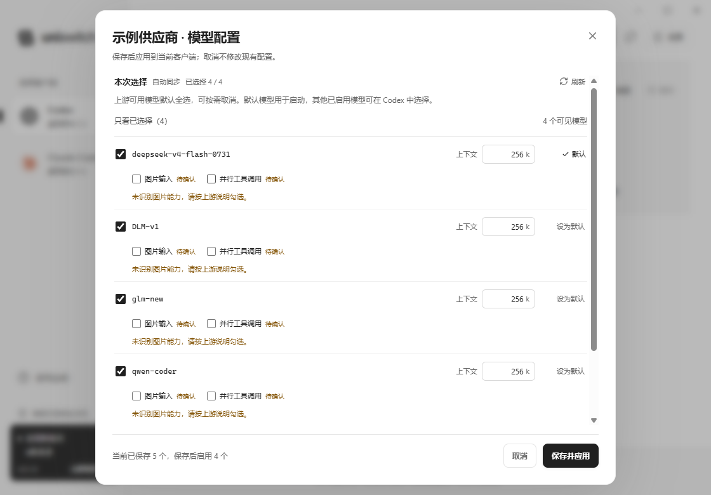

# uni-switch

简洁的 Codex / Claude Code API 配置工具。填写 **API 地址、API Key**，点击 **添加并使用**；日常切换只需一次点击。

**当前版本：0.5.21 · Windows / Linux / macOS · AGPL-3.0-only**

[下载安装包](https://github.com/dieqiyun/uni-switch/releases/latest) · [使用教程](docs/tutorial.md) · [供应商赞助](docs/sponsors.md) · [更新记录](CHANGELOG.md) · [问题反馈](https://github.com/dieqiyun/uni-switch/issues) · [参与开发](CONTRIBUTING.md) · [开源许可](LICENSE)



本版新增每次选择 GitHub 手动下载或远程更新，并在切换后明确提醒新开对话；修复重新应用供应商导致有效思考强度丢失和默认模型状态误导的问题。外部配置冲突时可确认后备份并覆盖。详见 [更新记录](CHANGELOG.md)、[远程更新说明](docs/remote-update.md) 和 [模型请求排查](docs/model-routing-diagnosis.md)。

## 供应商赞助名单

感谢 **蝶祈云 API** 对 uni-switch 的支持。目前供应商赞助名单仅列出蝶祈云。

<table>
  <tr>
    <td width="150" align="center">
      <a href="https://www.dieqiyun.top/"><br /><strong>蝶祈云 API</strong></a>
    </td>
    <td>
      蝶祈云为个人开发者、科研探索者及团队提供 AI API 渠道接入，官网展示 GPT、Claude、Gemini 与国内模型生态。其渠道建设涵盖 <strong>GPT 真官 Key 科研探索、国外机构合作定制、高质量渠道聚合</strong>，让不同模型与渠道在同一入口更方便地选择。<br /><br />
      除个人使用外，也面向项目开发与长期使用需求提供机构定制渠道；官网提供用户社区和联系支持入口，并支持开具发票，团队采购或报销可向支持确认开票资料与办理方式。接入时，从控制台复制对应渠道的 <strong>API 地址与 API Key</strong>，在 uni-switch 点击「添加并使用」，即可继续自动检测协议、同步模型和应用客户端配置。<br /><br />
      <a href="https://www.dieqiyun.top/">访问蝶祈云官网 ↗</a> · <a href="docs/sponsors.md">详细介绍与接入说明</a> · <a href="docs/tutorial.md#getting-started">首次配置教程</a>
    </td>
  </tr>
</table>

介绍依据蝶祈云官网公开内容整理；模型权限、API 接入地址、价格和服务安排以实际控制台及服务方说明为准。

## 功能

- 管理 Codex 桌面端 / CLI、Claude Code 桌面端及 Claude CLI 的 API 配置，同一供应商可在客户端之间复用。
- 自动检测协议、认证方式、上游模型和余额，无需选择站点类型或手填模型 ID。
- 默认启用全部适用模型。每个模型可设置上下文长度，默认 256k。
- 同步成功后移除上游已下架的模型，并为失效默认模型选择有效替代项；同步失败保留原列表。
- 双向协议转换：Codex 使用 Claude Messages 模型；Claude Code 使用 OpenAI 模型。
- 供应商列表直接切换默认模型、上下文、Fast 加速模式和协议转换；完整模型配置在弹窗中确认。
- Codex 配置写入时自动检查思考强度显示并保留有效用户选择。实际修改后提示重启和新开对话；Claude 未运行时也提示后续启动与新对话。
- 本地配置备份、外部修改冲突检测、确认覆盖及恢复原配置；后台协议转换与可选 Windows 登录启动。
- 左下角版本入口检查 GitHub 最新正式版，发现新版时持续显示提醒；每次选择手动下载或远程下载、校验后确认安装。
- 软件内提供可离线查看的分类教程，与 GitHub 使用教程共用内容。

## 使用

详细操作见 [完整中文教程](docs/tutorial.md)。软件左下角「使用说明」可离线阅读相同教程。

1. 在左侧选择 Codex 或 Claude Code；Claude Code 可分别选择桌面端和 CLI。
2. 点击 **添加供应商**，填写 API 地址和 API Key，点击 **添加并使用**。
3. 按提示重启对应客户端并新开对话，确认模型和思考强度。旧 Codex 会话或恢复的会话仍可能保留原选择。
4. 后续切换点击供应商行的 **使用**。点击 **管理模型**调整启用列表、默认模型和上下文。

模型弹窗中的同步和选择属于草稿，取消不会写入。当前供应商确认保存后立即应用；未使用供应商在下次使用时应用。余额查询范围由上游接口决定，密钥额度与账户余额会分别标注。

配置目录在 **设置** 中查看和修改，通常保留默认值即可。关闭窗口后应用驻留托盘，协议转换继续运行；升级前从托盘退出旧版。

## 下载与更新

从 [GitHub Releases](https://github.com/dieqiyun/uni-switch/releases/latest) 下载对应系统的程序：

| 系统 / 文件 | 用途 |
| --- | --- |
| Windows x64：`uni-switch_0.5.21_x64-setup.exe` | 安装包，推荐 Windows 用户使用 |
| Windows x64：`uni-switch_0.5.21_x64-portable.zip` | 便携程序、说明和许可证 |
| Windows x64：`uni-switch_0.5.21_x64.exe` | 独立程序，需要系统已有 WebView2 |
| Linux x64：`uni-switch_0.5.21_amd64.deb` | Ubuntu 22.04+ / Debian 12+ 桌面系统 |
| Linux x64：`uni-switch_0.5.21_x86_64.AppImage` | 设置可执行权限后运行，需要桌面环境与 WebKitGTK 4.1 |
| macOS：`uni-switch_0.5.21_universal.dmg` | 通用安装包，同时包含 Intel 和 Apple Silicon 架构 |
| macOS：`uni-switch_0.5.21_universal.app.tar.gz` | 通用 app 归档 |
| `uni-switch_0.5.21_source.zip` | 与三平台程序对应的完整源码和构建文件 |
| `README-zh-CN.md` / `SHA256SUMS.txt` | 完整教程 / 附件校验值 |

继续提供完整源码及三平台程序，许可保持 AGPL-3.0-only，历史版本全部保留。每次更新选择「GitHub 手动下载」或「远程更新」，检测不会自动下载安装。远程更新下载并校验本系统安装包，仍需点击「安装更新」：Windows 启动向导并退出应用，macOS 打开 DMG 后拖入安装，Linux 使用系统安装程序或替换 AppImage。详情见 [远程更新说明](docs/remote-update.md)。

macOS 包使用 ad-hoc 签名，尚未经过 Apple Developer ID 签名与公证；首次打开如被阻止，请先核对发布来源和校验值，再到「系统设置 → 隐私与安全性」允许打开。Linux AppImage 如缺少 FUSE，可使用 `--appimage-extract-and-run`；DEB 通过包管理器安装依赖。

三平台均支持配置读写与协议转换。Windows 提供运行客户端检测、自动重启和登录启动；macOS / Linux 当前请手动重启对应客户端并自行设置登录启动。Claude 桌面第三方模型配置仍取决于实际客户端对 Gateway 的支持，构建启动成功不等于所有客户端版本均经过实机验证。

## 从源码构建

架构：**Tauri 2 + Rust + React + TypeScript + Vite + SQLite**，技术选型参考 [cc-switch](https://github.com/farion1231/cc-switch)。

通用构建环境：Node.js 20 或更新版本、Corepack / pnpm 10.12.3、Rust 1.89 或更新版本、Visual Studio C++ Build Tools（含 Windows SDK）及 WebView2（Windows）。Linux 安装 Tauri 的 WebKitGTK 4.1 / GTK 依赖，macOS 安装 Xcode Command Line Tools。

```powershell
corepack enable
corepack pnpm install --frozen-lockfile
corepack pnpm typecheck
corepack pnpm test
powershell -NoProfile -ExecutionPolicy Bypass -File scripts/with-msvc.ps1 -Action test
powershell -NoProfile -ExecutionPolicy Bypass -File scripts/with-msvc.ps1 -Action build
```

安装包输出到 `src-tauri/target/release/bundle/nsis/`，主程序在 `src-tauri/target/release/uni-switch.exe`。预编译图标、模型基础指令和资源已包含在仓库中，常规构建无需图像生成服务或私有凭据。

开发桌面应用使用 `corepack pnpm dev`；仅预览界面使用 `corepack pnpm dev:web`。浏览器预览不写入真实客户端配置。配置实现、协议兼容范围及隔离测试说明见 [docs](docs/qa-inventory.md)。三平台原生构建工作流见 [.github/workflows/build-desktop.yml](.github/workflows/build-desktop.yml)，正式发布流程见 [发布说明](docs/github-release.md)。

## 参与开发

欢迎通过 Fork + Pull Request 参与开发，最终由 @dieqiyun 审核并决定合并。请先阅读 [贡献指南](CONTRIBUTING.md)；PR 会自动运行前端检查和三平台 Rust 测试 / Clippy，检查成功后不会自动合并。主分支的审核和保护设置见 [维护者操作指南](docs/maintainer-workflow.md)。

## 数据与兼容性

供应商密钥和客户端配置保存在本机；GitHub 更新检查不携带供应商认证。源码仓库与发布附件排除真实 API Key、数据库、客户端配置、测试运行数据和构建缓存。

协议探测依据模型接口响应，不发送计费推理请求；上游模型名称或菜单中的思考档位不能保证模型实际能力。Fast 请求优先服务档位，需要上游支持；Claude 转换暂不支持 Fast。原生 QA 使用隔离目录和模拟供应商，真实供应商的权限、额度与兼容性仍取决于其部署。

## 开源许可

Copyright (C) 2026 dieqiyun and uni-switch contributors.

本项目自 **v0.5.17** 起以 **GNU Affero General Public License v3.0 only（AGPL-3.0-only）** 发布。完整条款以 [LICENSE](LICENSE) 为准：

- 分发本项目或修改后的版本时，按 AGPL 提供对应源码并保留许可及版权声明。
- 修改后的版本通过网络与用户交互时，也应按 AGPL 第 13 条向这些用户提供对应源码获取入口。
- AGPL 允许商业使用；纯私人使用或修改本身不要求向公众发布源码。独立程序不会仅因与本工具通信就自动受同一许可约束。
- 本软件按现状提供，不提供任何保证。

第三方组件保留各自许可。Codex 通用基础指令采用 Apache-2.0；OpenAI、Anthropic 和蝶祈云品牌标志保留各自权利，不纳入程序的 AGPL 授权。详见 [第三方声明](THIRD_PARTY_NOTICES.md) 和 [NOTICE](NOTICE)。旧版已授予的许可不因本次更换许可而撤销。
