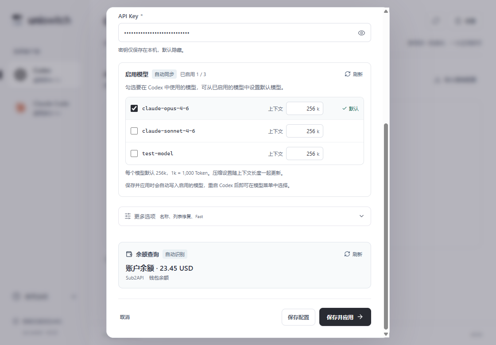

# 0.3.2 自动余额查询

余额查询默认自动运行，不再显示开关、站点类型、查询路径、除数、控制台令牌或用户 ID。Codex 与 Claude 均适用。

## 使用

添加配置时填写 API 地址与 Key，停止输入约 650 毫秒后自动检测。结果显示在表单底部“余额查询 · 自动识别”区域。编辑现有配置时 Key 留空会复用已保存密钥。

保存后供应商列表自动查询，旧配置未设置余额查询也会自动检测。查询期间可以继续编辑、保存或应用；失败在区域内显示原因。结果旁有刷新按钮。地址或 Key 改变时旧结果清空，旧请求不会覆盖新结果。

## 探测顺序与结果含义

| 探测 | 凭据 | 结果 |
| --- | --- | --- |
| Sub2API `/v1/usage` | 当前推理 API Key | 根据响应显示账户余额、密钥额度或订阅额度，支持周期限额、零余额和无限额度 |
| New API `/api/usage/token/` | 当前推理 API Key | 密钥剩余额度及无限额度；保留接口末尾 `/` |
| New API `/api/status` | 不发送凭据 | 读取站点额度单位、除数及汇率，供额度显示使用 |
| 已保存的 New API `/api/user/self` | 旧版保存的控制台 Token 与用户 ID | 原绑定站点的账户余额；新增配置无需填写 |
| `/v1/dashboard/billing/subscription` 与 `/usage` | 当前推理 API Key | 计算 `hard_limit_usd - total_usage / 100`，显示“可用额度” |
| `/v1/dashboard/billing/credit_grants` | 当前推理 API Key | 兼容站点的 `total_available` |
| 已保存的自定义路径 | 当前推理 API Key | 常见接口不可用时，兼容旧自定义 JSON 查询 |

New API billing 的账户 / 密钥范围由服务端 `DisplayTokenStatEnabled` 决定，公开状态没有该开关，无法仅凭请求成功证明账户余额。界面会标明“由站点决定返回账户余额或密钥额度”。billing 不可用但 token 查询成功时，显示“密钥额度”并说明账户余额接口未返回可用结果。

New API 原始密钥额度按公开 `quota_per_unit` 换算，未提供时采用上游默认 500000 = 1 USD；支持 USD、CNY 与 TOKENS。CNY 的原始额度换算需要有效汇率，缺失汇率时保留 USD。billing 响应已由服务端换算，不再除以 500000。旧版显式 token 换算在没有公开状态时继续保留。

自动识别检查响应结构，不仅依赖接口返回 HTTP 200。不存在余额、权限拒绝、网络异常与频率限制不会显示成 0。接口不开放 API Key 查询时无法自动取得余额，仍可正常配置客户端。

## 地址、请求与旧数据

从 API 地址去掉末尾 `/v1` 或 `/backend-api/codex`，保留部署前缀。例如 `https://example.com/gateway/v1` 会查询 `https://example.com/gateway/v1/usage` 和 `https://example.com/gateway/api/usage/token/`。旧版显式站点地址继续兼容；不猜测另一个控制台域名。

单次接口请求最多 4 秒，总探测预算 22 秒；HTTP 429 后停止追加探测。前端同时查询最多三家供应商；已保存配置的请求与结果复用 30 秒，手动刷新跳过缓存。保存或删除配置会立即使该供应商的旧缓存失效；即使在同一秒更换 Key，或新 Key 的尾号相同，也会重新查询。没有后台定时轮询，列表加载、表单输入及手动刷新才会触发查询。

控制台 Token 单独保存在本地，仅发送至旧账户查询接口；公开状态不带任何凭据。普通探测使用推理 Key，控制台 Token 不会被写入客户端或返回在供应商摘要中。修改 API 地址或重新输入 Key 后保存自动查询配置并清除旧控制台 Token。

## 验证

前端 18 项测试通过，验证默认查询、零余额、无类型字段、失败继续保存、输入变更丢弃旧结果、并发限制、缓存复用和保存后缓存失效。Rust 29 项测试通过，验证接口路径、结构识别、New API 差值与单位、429 中止、旧配置与凭据隔离，同时保留既有客户端写入恢复测试。TypeScript / Vite 构建与 Clippy `-D warnings` 通过。

`scripts/qa-auto-balance.mjs` 使用独立 Tauri WebView、数据库、Codex / Claude 目录和本地 HTTP 服务。9 组原生流程验证通过，覆盖表单与列表自动加载、Sub2API 额度、New API billing 与额度回退、旧配置、凭据分离、Claude、最小窗口。表单、完整供应商列表与 760 像素表单的三次 Axe 检查均无违规，前端无运行错误。结果位于 `.qa/auto-balance/native/results.json`。

Windows x64 0.3.2 正式安装包与独立程序位于 `release/windows-x64`，附带 `SHA256SUMS-0.3.2.txt`。复制后的正式程序已完成隔离启动检查：数据库初始化成功、窗口正常响应、9223 QA 调试端口关闭，结果位于 `.qa/auto-balance/release-smoke/results.json`。

验证使用本地模拟端点及虚构 Key，不代表某家真实供应商的部署接口、权限与计费设置已经完成验收。上游依据见 [New API API Key 源码核查](newapi-apikey-balance.md) 与 [0.3.1 适配记录](balance-adapters.md)。
