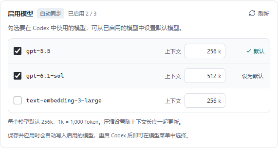

# 0.3.3 自动模型同步

> 2026-10-07更新：成功同步后移除已不在上游列表中的模型，默认值下架时自动替代；确认保存后同步移除Codex目录中的旧项。新增适用模型默认全选，失败保留原列表。当前规则见[模型同步移除下架项目](model-catalog-refresh.md)，下方保留早期设计记录。

> 0.4.0 操作更新：默认两字段、自动推荐模型，协议与认证放在高级设置；编辑和修复先保存在草稿，点击“保存并使用”后一起写入，取消不会写入。启动已自动检查配置目录。本文下方旧版操作与截图保留为历史记录，最新流程见 [简化流程](simple-flow.md)。

添加 / 编辑配置不再要求输入模型 ID。填写完整 API 地址和 Key 后自动查询可用模型，用户勾选要启用的模型并从列表设置默认模型。Codex 和 Claude 使用同一个操作方式。

## 使用与失败处理

停止输入约 650 毫秒后开始查询。首次自动启用一个模型作为默认，其他模型由用户勾选；选中的模型可设为默认。取消默认模型时自动改用另一个已启用模型。全部取消时保存会提示至少勾选一个模型。

超过 8 个模型提供搜索，最多读取 500 个。列表支持键盘 Tab / Space 操作。刷新保留当前勾选与默认选择，新发现的模型默认不启用；当前默认模型消失时改用仍存在的已启用模型或第一个可用模型。

编辑已有配置先显示保存的模型；旧版只保存默认模型时也能正常打开、选择与保存。同步失败会显示原因，并允许继续使用原模型列表。新增配置查询失败或没有可用模型时可重试，无法保存一组没有模型的配置。未开放模型列表接口的供应商无法通过当前表单新增，界面不再提供手填模型入口。

修改地址、Key 或认证方式立即清空旧模型并重新同步，旧慢请求无法覆盖新连接结果。同步不会锁住地址、Key 与取消按钮。模型同步与余额查询独立运行，只查询接口，不发送推理请求。

## 接口与客户端应用

模型地址优先使用 `${baseUrl}/models`；地址末尾没有 `/v1` 或 `/backend-api/codex` 时，在接口不存在或响应结构不适用时尝试 `${baseUrl}/v1/models`。保留反向代理路径，不跨域探测。401 / 403 / 429 不继续猜测其他路径。请求拒绝重定向、限制响应 2 MB、单接口最多 10 秒、总预算 25 秒。

Bearer 模式使用 `Authorization: Bearer`；Claude 的 `x-api-key` 模式发送 `x-api-key` 与 `anthropic-version: 2023-06-01`。原生 Claude `has_more` / `last_id` 响应会继续用 `after_id` 查询，合并去重，最多 10 页；失败不保存不完整的列表。

Codex 将启用的模型写入 `uni-switch-models.json`，默认模型写入 `config.toml`。未启用模型不会进入模型目录；目录与主配置继续使用原有备份、原子写入和恢复流程。重启 Codex 后模型菜单读取目录。

Claude 桌面端在原生 Messages 模式仅允许可识别的完整 Claude 名称。0.3.8 选择 OpenAI 后可勾选 GPT；写入兼容 ID 与 `labelOverride`，菜单保留真实 GPT 名称，本地服务映射真实模型。启用模型写入第三方 profile 的 `inferenceModels`，默认模型放在首位；导入现有 profile 会保留完整模型列表。Claude CLI 使用 `ANTHROPIC_MODEL` 作为默认，并将启用列表内的 Sonnet / Opus / Haiku 模型映射到对应 `ANTHROPIC_DEFAULT_*_MODEL`，没有对应档位时使用默认模型。CLI 没有与 Codex 相同的自定义模型目录，GPT 转换的默认模型与 `--model` 已验证，不承诺 `/model` 展示全部 GPT。

模型列表表示 Key 可见的模型，不证明其支持 Codex Responses / 工具调用或 Claude Messages 协议。是否能实际推理仍需站点接口兼容。

## 验证

前端 24 项测试通过，组件 / Hook 覆盖防抖、输入完整才查询、默认选择、勾选切换、全部取消、旧慢响应丢弃、刷新保留选择、失败保留列表、旧配置、Claude 过滤、保存应用重试。Rust 30 项测试通过，覆盖 Bearer 与 x-api-key 请求、客户端多模型配置、CLI 档位映射和导入恢复。TypeScript / Vite 构建及 Clippy `-D warnings` 通过。

原生脚本 `scripts/qa-auto-models.mjs` 使用隔离数据库、Codex / Claude 目录、本地模拟 HTTP 服务与虚构 Key。6 组原生流程通过，验证自动同步、勾选、默认切换、模型目录实际写入、权限 / 空列表失败、地址切换、搜索键盘、小窗口、Claude 根地址回退与分页、桌面 profile 与 CLI 配置。四次 Axe 检查无违规、前端无运行错误。结果位于 `.qa/auto-models/native/results.json`。余额回归使用 `scripts/qa-auto-balance.mjs`。

0.3.3 原生余额回归的 9 组流程通过。Windows x64 正式安装包与独立程序位于 `release/windows-x64`，附带 `SHA256SUMS-0.3.3.txt`。正式程序的隔离启动检查通过，数据库正常初始化、窗口响应正常、9223 QA 调试端口关闭；结果位于 `.qa/auto-models/release-smoke/results.json`。

真实供应商、Codex / Claude 桌面端实际推理未使用用户凭据验证；这些流程签收本地配置和模型同步行为。
