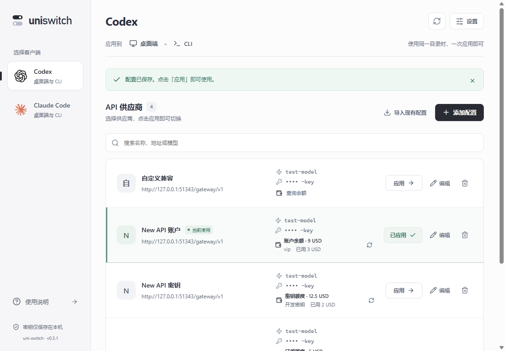
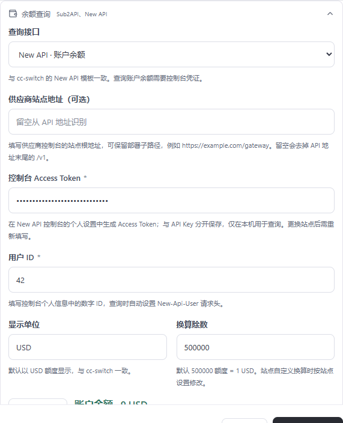

# 0.3.1 余额查询适配

> 本文记录 0.3.1 的历史界面。0.3.2 已移除查询开关、站点类型及额外配置字段，默认根据 API 地址与 Key 自动检测；现行使用方法见 [自动余额查询说明](auto-balance.md)。旧配置继续兼容。

修复 0.3.0 仅填写 JSON 字段的余额查询方式，按 cc-switch 的 New API 模板与 Sub2API / New API 源码实现原生适配。保留供应商列表布局和按需查询。

## 设置方法

编辑 Codex 供应商，展开“余额查询”，选择对应系统，点击“查询余额”验证后保存。

| 查询类型 | 凭据 | 接口 | 显示含义 |
| --- | --- | --- | --- |
| Sub2API | 当前 API Key | `/v1/usage` | 钱包余额、密钥额度或订阅额度，由响应类型判断 |
| New API 账户余额 | 控制台 Access Token + 数字用户 ID | `/api/user/self` | 账户剩余额度、已用额度、用户分组 |
| New API 密钥额度 | 当前 API Key | `/api/usage/token/` | 这把密钥的剩余、已用额度，或无限额度 |
| 兼容 billing | 当前 API Key | `/v1/dashboard/billing/credit_grants` | `total_available`，需站点开放此接口 |
| 自定义 JSON | 当前 API Key | 用户填写 | 按 JSON 字段路径、单位和除数读取 |

New API 的控制台 Access Token 与用于调用模型的 `sk-…` API Key 属于不同凭据。按站点版本，在控制台个人设置中生成访问令牌并查找数字用户 ID；请求自动设置 `Authorization: Bearer <accessToken>` 和 `New-Api-User: <userId>`。密钥额度类型不需要这些额外字段。

补充核查：New API 还提供仅用 API Key 认证的 `subscription + usage` billing 查询，站点 `DisplayTokenStatEnabled=false` 时可读取账户余额，开启时读取密钥额度。0.3.1 尚未实现这条双接口途径，当前账户查询采用上表的 `/api/user/self`；不能因此将其额外凭据要求推广到 New API 的所有余额接口。导入按钮、认证链及服务端开关的源码证据见 [New API API Key 余额核查](newapi-apikey-balance.md)。

Sub2API 的“导入 CC Switch”按钮生成 `ccswitch://v1/import?...` 深链接，携带 `apiKey`、`usageEnabled=true`、Base64 编码的 `usageScript` 和 `usageAutoInterval=30`。脚本去掉 API 地址末尾的 `/v1` 后请求 `/v1/usage`，通过 `Bearer {{apiKey}}` 认证，依次读取 `remaining`、`quota.remaining`、`balance`。该导入流程没有携带控制台 Access Token 或用户 ID；它把余额查询规则一起导入了 cc-switch。本项目的 Sub2API 适配器采用相同接口和 API Key 认证，在 Rust 中解析更多订阅信息。

New API 返回原始额度整数，默认与 cc-switch 一致，按 500000 = 1 USD 换算。不同站点可以修改单位和除数；这是额度显示换算，不做汇率推测。无限密钥额度不代表账户余额无限。

Sub2API 钱包使用 `balance`；总额度密钥使用 `quota.remaining / used / limit`；订阅读取日、周、月限额与已用金额，显示各周期剩余及最小可用额度。仅有密钥周期限额时显示这些周期额度。上游明确返回 `remaining = -1` 的无限订阅显示“无限额度”。缺失余额和订阅状态时报告错误。`/v1/sub2api/billing` 只返回计费倍率，不能当作余额接口。

## 地址与凭据

站点地址留空时，从 API 地址移除末尾 `/v1` 或 `/backend-api/codex`，保留反向代理部署前缀。例如 API 为 `https://example.com/gateway/v1` 时，New API 账户查询为 `https://example.com/gateway/api/user/self`。API 与控制台域名不同或存在其他网关前缀时，手动填写“供应商站点地址”。显式站点地址作为根地址，不自动删除它的部署前缀。自定义 JSON 的 `/path` 仍从域名根路径解析，兼容旧配置。

控制台 Access Token 单独保存在本地数据库私有字段，列表、概览和编辑表单不返回令牌正文，仅返回是否已保存。编辑时留空保留；更换查询站点需要重新输入，避免自动把原账户令牌发送到新站点。关闭账户余额查询会清除保存的账户令牌。令牌不会写入 Codex 或 Claude 配置。

请求不跟随重定向，连接超时 8 秒，总超时 15 秒，响应上限 2 MB。New API 密钥接口保留末尾 `/`，符合其 Gin 路由注册，避免旧版重定向失败。错误不返回供应商响应正文或完整密钥。

查询由用户点击触发，不后台轮询。列表查询失败时保留并标记上次结果；表单重新查询会清除旧结果，防止误读。余额不持久化。0.3.0 的内置 New API 预设（原始额度、除数 1）自动迁移到新密钥适配器，其他自定义接口和换算不改动。

## 来源

- [cc-switch New API 查询模板](https://github.com/farion1231/cc-switch/blob/243cd9a93b67f56efac173f32505b4085fb40cae/src/components/UsageScriptModal.tsx)：账户认证及 500000 额度换算；本项目以 Rust 原生适配器实现，无任意脚本执行。
- [Sub2API 导入按钮与查询脚本](https://github.com/Wei-Shaw/sub2api/blob/b8dece9000c68815a5b867ca5a1e6f236e173905/frontend/src/utils/ccswitchImport.ts)：深链接参数及 API Key 查询方式。
- [Sub2API 导入按钮调用处](https://github.com/Wei-Shaw/sub2api/blob/b8dece9000c68815a5b867ca5a1e6f236e173905/frontend/src/views/user/KeysView.vue#L2026)：`row.key` 和内置查询脚本一起生成导入链接。
- [Sub2API 网关路由](https://github.com/Wei-Shaw/sub2api/blob/b8dece9000c68815a5b867ca5a1e6f236e173905/backend/internal/server/routes/gateway.go) 与 [用量接口](https://github.com/Wei-Shaw/sub2api/blob/b8dece9000c68815a5b867ca5a1e6f236e173905/backend/internal/handler/gateway_handler.go)：`/v1/usage` 的钱包、密钥、订阅和周期额度响应。
- [New API 密钥接口](https://github.com/QuantumNous/new-api/blob/973cf8ef4600947a4270e95ada7916740fa8264c/controller/token.go) 与 [路由](https://github.com/QuantumNous/new-api/blob/973cf8ef4600947a4270e95ada7916740fa8264c/router/api-router.go)：末尾斜杠、原始额度和无限标志。

## 验证

Rust 22 项测试通过，覆盖上游响应结构、零余额、无限额度、账户认证请求头、部署前缀、尾部斜杠、私有令牌保留、站点变更保护和旧配置迁移。前端 14 项测试通过，覆盖预设、账户必填字段、查询与保存、已保存凭据不回显。真实 Tauri IPC 的 7 组回归通过，使用本地模拟 Sub2API / New API 接口和隔离配置目录，列表、账户表单及 760 像素最小窗口的 Axe 检查均为 0 违规。Rust Clippy 与生产构建通过。

验证脚本为 `scripts/qa-balance-adapters.mjs`，结果保存于 `.qa/balance-adapters/native/results.json`。脚本运行需要自行编译的隔离 QA 程序，使用 `cargo build --release --features qa-webview,tauri/custom-protocol --manifest-path src-tauri/Cargo.toml`，通过 `UNI_SWITCH_QA_EXE` 指定它的路径；正式交付程序不启用 QA 调试端口。

Windows x64 0.3.1 安装包已生成，另存于 `release/windows-x64`，同时提供独立程序及 `SHA256SUMS-0.3.1.txt`。复制后的正式程序启动检查通过：隔离数据库初始化成功，窗口响应正常，9223 QA 调试端口关闭；结果保存于 `.qa/balance-adapters/release-smoke/results.json`。

未使用真实供应商账户凭据；针对不同站点的版本、权限与自定义额度换算，实际查询以该站点返回为准。
