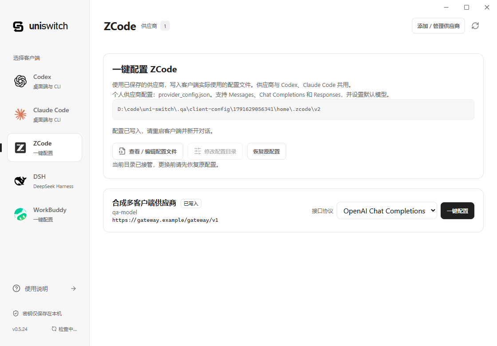
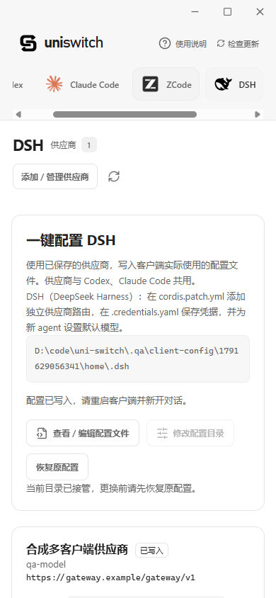

# 多客户端配置与文件编辑

左侧新增 ZCode、DSH（DeepSeek Harness）、WorkBuddy。一键配置使用现有供应商记录，不需要重复保存密钥。

| 客户端             | 默认文件                                                   | 原生协议                              |
| ------------------ | ---------------------------------------------------------- | ------------------------------------- |
| Codex              | $CODEX_HOME/config.toml、auth.json、uni-switch-models.json | 沿用现有配置入口与协议转换            |
| Claude Code CLI    | $CLAUDE_CONFIG_DIR/settings.json                           | 沿用现有入口                          |
| Claude Code 桌面端 | 当前部署配置与 configLibrary 下应用的 UUID 档案            | 沿用现有入口                          |
| ZCode              | ~/.zcode/v2/provider_config.json                           | Messages、Chat Completions、Responses |
| DSH                | $DSH_HOME/cordis.patch.yml、.credentials.yaml              | Messages、Chat Completions、Responses |
| WorkBuddy          | ~/.workbuddy/models.json                                   | Chat Completions                      |

ZCode 遵循 ZCODE_DATA_BASE_DIR 和 ZCODE_PERSONAL_PROVIDER_CONFIG_FILE。DSH_HOME 缺省为 ~/.dsh。现有 Codex/Claude 的路径发现机制保留。所有页面都显示实际文件路径，可选择自定义配置目录。WorkBuddy 的官方文档同时提到旧 ~/.codebuddy/models.json 的兼容性；如客户端仍使用旧文件，选择对应目录。项目级配置、启动环境变量和 DSH profile 设置可能影响实际选择。

## 原生写入

- ZCode 使用 schemaVersion 1 个人供应商规则，管理 uni-switch 提供方，保留其他提供方、排序及模型规则，设置 defaultModelSelection。不修改内置供应商配置。
- DSH 在保留原文本的管理区块中插入 uni-switch-llm，多实例使用独立供应商路由；更新 agent-default-model，凭据引用写入 version 1 的 refs。旧的平铺凭据格式不会自动迁移。管理区块外的注释及 !!js 标记不会执行或重写。DSH 的 Anthropic SDK 地址去除终端 /v1，避免重复路径。ZCode 的 Anthropic 适配器补齐 /v1 后由 AI SDK 加 /messages；OpenAI SDK 仅追加资源名。
- WorkBuddy 合并 models 列表和已存在的非空 availableModels，保留其他模型。采用完整 /chat/completions 地址，能力字段仅写入已有依据的值。客户端默认模型需要在自身选择器中选用。公开配置没有自定义认证头字段，非 Bearer 供应商在写入前明确拒绝，不输出无法表示认证方式的配置。
- 每个客户端可选择原生协议；显式标记不支持的模型以及跨协议且没有支持依据的模型在写入前报错。不根据模型名称猜测协议。

## 请求地址与认证

三个新增客户端直接连接供应商，使用各自原生适配器，不经过 Codex 的 Responses ↔ Messages 转换桥。

- 裸站点地址（例如 https://gateway.example）用于 OpenAI 时，配置补入标准 /v1。显式填写 /proxy、/api/paas/v4 等 API 前缀时保持原路径，不盲目追加 /v1。
- 填入完整 /messages、/responses 或 /chat/completions 时，仅去掉资源名再交给对应 SDK；末尾斜杠一并清理，避免重复资源路径。完整 https://gateway.example/chat/completions 表示明确的无版本路径，不自动改成 /v1。
- ZCode / DSH 的自定义 headers 按供应商认证方式写入 x-api-key，Messages 的 Bearer 模式写入 Authorization。客户端 SDK 可能同时附带自身默认认证头；验证保证所选认证头存在，不代表所有网关均接受双认证头。
- WorkBuddy 只在 Chat Completions 与 Bearer 都适用时写入。不将 Claude 模型名称当作端点支持证据；仅提供 Messages 或 Responses 的模型会在写入前拒绝。

保存供应商不会自动覆盖已有客户端文件。升级后回到对应客户端页重新「一键配置」，确认写入提示后退出并重开客户端、新开对话；文件被手动修改过时仍需确认覆盖。

## 原生客户端的兼容边界

2026-10-10 的隔离 SDK 检查使用 uni-switch 实际桌面 IPC 导出的 78 组配置；没有向真实供应商发送请求。

| 检查                           | 结果与范围                                                                                                                                                                         |
| ------------------------------ | ---------------------------------------------------------------------------------------------------------------------------------------------------------------------------------- |
| ZCode / DSH 普通多轮、工具续接 | Messages、Chat Completions、Responses 的地址、选定认证头、消息字段、调用 ID 与结果顺序通过。ZCode 同时消费 JSON 与 SSE，DSH 消费其原生 SSE。                                       |
| 中途 system 指令               | DSH 此次生成的默认模型兼容设置会合并指令，内容保留。ZCode AI SDK 会发送会话中 system 与 mid-conversation-system 扩展头；仅接受 user/assistant 的旧 Messages 网关在探针中返回 400。 |
| assistant prefill              | 向 ZCode / DSH Messages SDK 显式提供 assistant 结尾历史时，两者都保留该结尾。模拟不支持 prefill 的上游返回截图同类 400；更改基础 URL 不解决这一限制。                              |
| WorkBuddy                      | 验证 6 组官方 models.json 字段与完整 Chat 地址，非 Bearer 写入在真实 uni-switch IPC 中拒绝且原文件不变。未安装其执行程序，未验证其消息序列化或完整 agent 会话。                    |

共 238 次 SDK 捕获请求：230 次正常请求通过；4 次 prefill 和 4 次旧网关 system-role 拒绝均为预期复现，不作为成功推理。SDK 探针只证明给定历史在这些版本下的请求与响应格式，不证明客户端正常 agent 流程一定生成这些历史，也不证明所有模型、图片、思考签名或工具扩展均已兼容。

ZCode / DSH 直连模式下，这些历史由原生客户端构建。遇到上述条件时，应升级到能处理该历史的客户端/网关；若供应商明确支持 Chat Completions，可在一键配置中选择它，避免 Messages 的这两类限制。只有 Messages 的供应商不能靠改协议名称变成 OpenAI。uni-switch 的 Codex 转换桥已处理 assistant 续接，但该修复不自动覆盖新增客户端的直连链路。

## 文件编辑

路径由后端允许列表决定，不接受任意 IPC 文件路径。页面先展示路径列表，只有主动选中文件才读取内容，默认只读；点击「开始编辑」后可保存。内容不进入 localStorage 或概览响应。JSON 顶层须为对象，TOML/YAML 使用解析器校验，解析错误不回显文件片段或密钥。单文件上限 4 MiB。

保存校验绑定目录、文件标识和内容摘要。发现外部变化拒绝写入并保留编辑草稿。符号链接或 Windows 重解析点拒绝访问。写入私有备份后进入事务日志，原子替换并回读；多文件中断会在下次打开时恢复，恢复不覆盖外部新内容。备份包含配置与凭据，保存在应用数据目录 backups/client-config-UUID.json。

手动保存不会把文件中的密钥反向采纳为供应商。已接管客户端标记手动修改，自动重用供应商不得静默覆盖；用户可查看当前文件后确认重新应用。已有 Codex/Claude 的手动修改也不会被启动时的模型迁移改写。

真正写入后提示完全退出并重新打开客户端、新开对话；WorkBuddy 还提示选择自定义模型。无变化、只查看、取消、失败不提示。本功能的通用提示不会自动停止进程；原有 Codex/Claude 一键重启行为继续由原入口提供。

新客户端恢复首次接管前的完整文件，所以接管后新增的手工设置可能被恢复替换，界面会明确确认。若有未确认的外部修改则拒绝自动恢复。

## 验证

- Rust 的 store/client_configs/tests.rs 验证三种官方格式、认证、中文、保留字段、幂等、格式拒绝、目录绑定、冲突确认、备份与事务中断恢复。
- ClientConfigEditor.test.tsx 验证主动读取、只读/编辑、保存、草稿保留、放弃确认、无变化不提示与三客户端入口。
- node scripts/qa-client-config.mjs 在 .qa 下创建独立配置、应用数据库和 WebView，用合成密钥检查真实桌面界面。检查官方本地图标加载、标签页关联、390px 下图标与文字不重叠、配置编辑/冲突/恢复及保存后的重启提示。脚本仅停止它创建的进程，CDP 9223 与其他原生验收串行。
- 加 --protocols 后通过实际 IPC 生成配置矩阵，并调用 scripts/qa-native-client-protocols.mjs 检查 SDK。依赖仅装入隔离 QA 目录，版本按此次官方源码依赖锁定：

```powershell
npm install --prefix .qa/extra-client-audit/sdk --ignore-scripts --no-audit --no-fund --save-exact @ai-sdk/anthropic@3.0.81 @ai-sdk/openai@3.0.58 @ai-sdk/openai-compatible@2.0.60 @earendil-works/pi-ai@1.0.2 yaml@2.8.1
node scripts/qa-client-config.mjs --protocols
```

配置快照与报告在 .qa/client-config/<timestamp>/protocol-fixtures.json、native-protocol-report.json；可单独传快照给 qa-native-client-protocols.mjs 重放。新客户端 SDK 未加入应用依赖或发布包。

## 界面验证

以下截图来自 v0.5.24 的隔离 QA，只包含合成供应商和测试目录。





## 官方格式参考

- ZCode: https://github.com/zai-org/ZCode （packages/provider-node、packages/provider/src/config、apps/zcode-cli/packages/adapters/src/model/model-execution.ts、anthropic-stream-compat.ts）。
- DSH: https://github.com/deepseek-ai/deepseek-harness （llm-pi-ai、credentials-local、agent-default-model）。
- WorkBuddy: https://www.workbuddy.cn/docs/workbuddy/From-Beginner-to-Expert-Guide/Function-Description/Model 。
- 兼容 models.json 字段: https://www.codebuddy.cn/docs/cli/models 。
