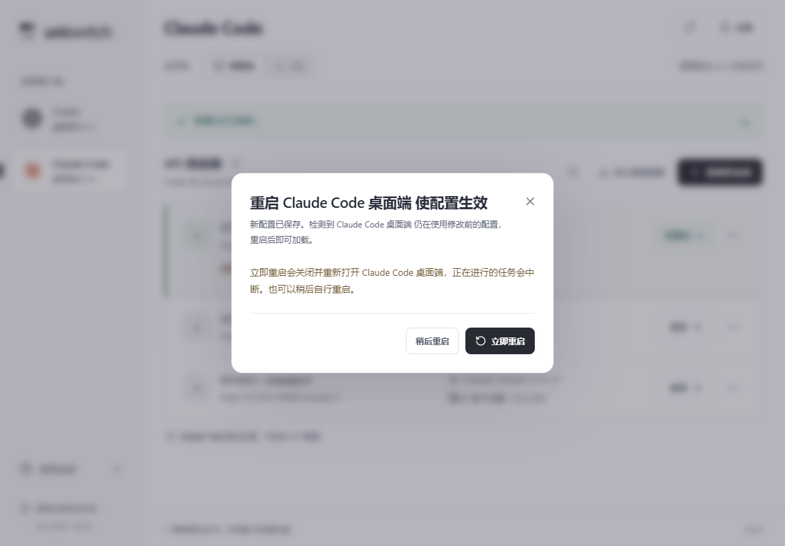
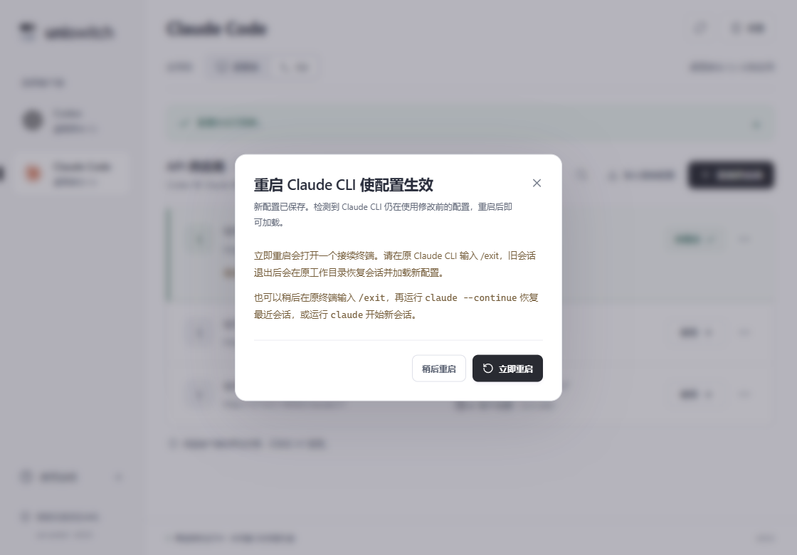

# 0.5.5 Codex、Claude Code 桌面端与 Claude CLI 重启选择

配置真实写入且使用对应配置目录的客户端仍在运行时，显示“重启……使配置生效”，提供“立即重启”和“稍后重启”。供应商应用、编辑并使用、同步和恢复原配置均接入检测。只保存供应商、相同配置无实际写入、写入失败或客户端未运行时，不产生新的重启提示。

三端独立记录配置版本和已提示版本。共享供应商同步写入多个客户端后，当前客户端优先，其他客户端依次提示；同一次修改在当前 uni-switch 会话内选择稍后后，不会因轮询或切换页面反复出现。供应商列表保留各自的重启入口。编辑和设置弹窗打开期间等待，关闭后再提示。

## 桌面端

Codex 和 Claude Code 桌面端使用 Windows Restart Manager 请求匹配应用正常退出，确认退出后才打开同一可执行文件。不使用强制退出标志，也不通过结束所有同名进程处理。

保留 Codex 的 CODEX_HOME、Claude 的 LOCALAPPDATA，以及 Electron 的绝对用户数据目录覆盖。识别桌面安装来源，排除 Claude 原生 CLI、npm CLI 和 Electron 子进程；仅操作绑定配置目录对应的根进程。多个匹配实例、窗口不可控制或启动文件失效时显示原因，并保留稍后与手动处理方式。

弹窗说明正在进行的任务会中断。重启失败保留新配置、错误原因和稍后选项。服务端再次检查配置版本，过期请求不关闭客户端。

## Claude CLI

CLI 通常位于共享终端中。“立即重启”打开接续终端，原 CLI 继续运行；用户回到原 CLI 输入 `/exit` 后，接续终端检测旧进程退出，再从原工作目录启动 CLI 加载新配置。返回结果在等待期间标记 `pending`，界面提示“等待退出”，不会把打开辅助终端报告为已完成重启。

支持原生 `claude.exe` 和 npm 的 `node.exe @anthropic-ai/claude-code/cli.js`。读取原进程工作目录与配置目录；存在有效 UUID 会话的 `--resume` 时恢复该会话，否则使用 `--continue`。不重放完整原命令行、提示词、旧 `--model` 参数或密钥。辅助终端从环境读取路径与参数，以参数数组启动，中文、空格、`&` 和方括号不作为 shell 指令处理。启动时清除 uni-switch 环境中可能残留的推理地址、密钥、模型与云服务覆盖变量，让 Claude 读取已保存配置。

辅助终端等待同一 PID 和创建时间的原进程，不发送终端中断信号，不强制结束 CLI、PowerShell 或终端宿主。重复操作复用正在等待的辅助终端；关闭该窗口可取消等待，原会话保留。旧 CLI 在辅助终端启动前已正常退出时，直接启动接续会话。

多个匹配 CLI、无法确认工作目录、print/SDK 自动化模式不自动启动交互会话，弹窗解释原因。用户可在原工作目录输入 `/exit` 后运行 `claude --continue`，或运行 `claude` 开始新会话。没有可恢复历史时，辅助终端提供直接启动新会话的命令。组织策略、项目设置或命令行覆盖仍可能影响最终配置。

## 可访问性与验证

默认焦点在“稍后重启”；Escape 与关闭按钮按稍后处理，点击外侧不关闭；执行按钮期间禁止重复提交或关闭，进度与错误可由辅助技术读取。

77项前端测试、98项Rust测试通过（1项辅助进程测试按设计忽略），31组Windows原生流程通过，15处Axe检查无违规，前端运行错误为0。TypeScript、生产前端构建、格式检查和Clippy通过。

前端测试覆盖三端队列、同一版本分别记录、后续写入、恢复、等待其他弹窗、稍后不调用重启、CLI等待提示与失败保留。Rust 测试覆盖三端身份、npm脚本与会话参数白名单、绑定目录、真实写入版本和恢复。Windows 验收使用隔离窗口与控制台进程，用户真实配置和正在运行的客户端保持原样。原生结果位于 `.qa/ux-flow/results.json`。

CLI验收覆盖等待旧进程、重复点击去重、过期配置版本拒绝、新PID、保留中文工作目录（含空格、`&`与方括号）、配置目录，以及不重放旧模型参数、不继承推理覆盖变量。验收发现PowerShell会重置工作目录，已通过辅助脚本中的 `Set-Location -LiteralPath` 和进程当前目录设置修正并重新验证。

正式包独立启动烟测因本机已有用户的0.5.3实例而未执行，保留了该实例；记录位于 `.qa/ux-flow/production-results.json`。

Windows x64正式安装包和单文件版已构建并交付到 `release/windows-x64`，复制后的SHA256与构建产物一致。所有隔离验收窗口和CLI进程均已退出，QA调试端口已关闭。

