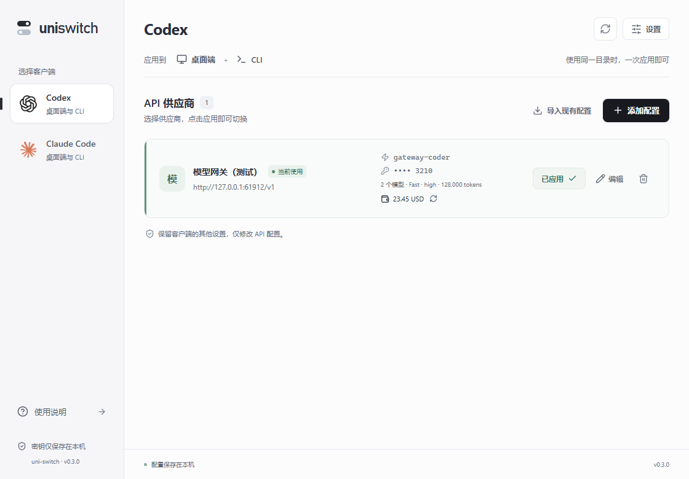
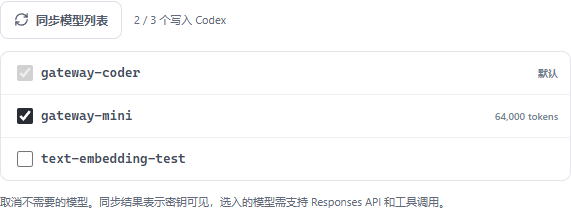

# 0.3.0 Codex 供应商配置与模型同步

2026-10-06 增加 Codex 供应商性能设置、模型目录与余额查询。保留 0.2.1 的官方 Logo 和供应商列表布局。

## 使用流程

1. 在 Codex 页面添加或编辑供应商，填写 API 地址与密钥。
2. 点击“同步模型列表”。新建配置使用输入的密钥，编辑时密钥留空使用已保存的密钥，完整密钥不返回前端。
3. 选择默认模型，勾选要写入 Codex 的模型。模型必须支持 Responses API 与工具调用；模型接口返回的 ID 不等于兼容性验证。
4. 在“更多选项”中调整 Fast、推理强度、上下文窗口及自动压缩阈值。
5. 点击“保存并应用”，完全退出并重启 Codex，使用新会话。在桌面端模型菜单或 CLI `/model` 中选择模型。
6. 0.3.2 起余额默认自动识别与查询，不需要设置开关或站点类型。保存后列表自动查询，可手动刷新，见 [自动余额查询说明](auto-balance.md)。

> 0.3.3 已将手动填写模型 / 点击同步改为自动同步与勾选，当前操作见 [自动模型同步说明](auto-models.md)。下文保留最初版本的配置映射与验证记录。

## 配置映射

| 界面 | Codex 字段或文件 | 行为 |
| --- | --- | --- |
| 默认模型 | `model` | 默认启动模型，用户仍可在 Codex 中另选已写入的模型 |
| 推理强度 | `model_reasoning_effort` | 默认、none、minimal、low、medium、high、xhigh、max、ultra，需模型支持 |
| Fast 开启 | `service_tier = "priority"`、`features.fast_mode = true` | 请求优先服务，可能有更高费率 |
| Fast 关闭 | `service_tier = "default"`、`features.fast_mode = true` | 默认请求标准服务，保留 Codex 自己的 Fast 控件 |
| 上下文窗口 | `model_context_window` | Token 数，不能提高模型实际的容量 |
| 自动压缩阈值 | `model_auto_compact_token_limit` | Token 数，Codex 仍会限制在模型窗口的 90% 内 |
| 模型列表 | `model_catalog_json` → `uni-switch-models.json` | 启动时加载，被选中的模型显示在模型选择列表 |

模型接口请求 `${baseUrl}/models`，使用 Bearer 认证。支持 OpenAI 格式的 `data` 数组和 Codex 格式的 `models` 数组，模型标识读取 `id` 或 `slug`。去重后最多 500 个模型。接口返回上下文或推理档位信息时保留，未返回时保持未知，不推测供应商能力。

目录采用 Codex `rust-v0.160.0` 的原始通用基础指令，避免缺失指令导致客户端拒绝整个目录。原文来自 `codex-rs/models-manager/prompt.md`，遵循 Apache 2.0，许可与来源见 [第三方声明](../THIRD_PARTY_NOTICES.md)。其他能力使用保守描述，实际调用仍以供应商支持为准。

模型目录与 `config.toml` 一起加入现有原子写入、备份、中断恢复和外部变更保护。恢复保留用户其他配置，并还原接管前模型目录。旧版数据库无需清空，缺少的新选项按默认值读取。升级时对新接管字段记录当前值，避免恢复到升级前更早的历史值。

在 Codex 内选择已应用目录中的模型、有效推理强度或标准/优先/灵活服务档位，仍被识别为同一供应商；路由、密钥、模型目录、上下文等字段的修改继续触发外部变更保护。uni-switch 中编辑后的默认值与实际客户端选择分别判断，编辑配置仍显示待应用。

## 余额接口

> 此节记录 0.3.0 的历史通用接口行为。0.3.2 已移除手动配置并支持 Sub2API、New API 与兼容接口的默认自动识别，现行使用方法及验证见 [自动余额查询说明](auto-balance.md)。

余额不是标准 OpenAI API，不自动猜测账户余额、币种或额度换算关系。提供以下配置：

| 预设 | 路径 | 数值字段 | 默认单位 / 除数 |
| --- | --- | --- | --- |
| 兼容 billing | `/v1/dashboard/billing/credit_grants` | `total_available` | USD / 1 |
| New API 密钥额度 | `/api/usage/token` | `data.total_available` | 额度 / 1 |
| 自定义 | 用户填写 | 例如 `data.balance` | 用户填写 |

预设仅用于填写字段，需要供应商实际开放对应接口。New API 的密钥额度与账户余额可能不同，显示为供应商返回的原始额度；需要货币单位时按供应商说明填写除数与单位。若实例配置了无限额度，数值字段本身不能代表账户可用余额，应以供应商说明为准。

请求为同域 GET，使用现有 API Key 的 Bearer 认证，不跟随重定向。15 秒总超时，8 秒连接超时，响应上限 2 MB。401/403、404/405、429、无效 JSON、缺失字段分别给出明确错误，不把响应正文或密钥放入错误消息。仅用户点击时查询；不后台轮询，不发送推理请求。

查询失败保留上次结果并标记，鼠标悬停可查看查询时间；查询结果不持久化，重新启动后需重新查询。

## 验证

- 前端 12 项测试通过，包括保存密钥的同步、模型勾选、性能设置、同步失败保留列表、压缩阈值校验和零余额。
- Rust 17 项测试通过，包括 HTTP 请求路径与认证、响应解析、错误反馈、模型目录切换与恢复、旧数据迁移、客户端模型选择和外部变更保护。
- 原有浏览器 8 组与真实 Tauri IPC 8 组回归通过。
- 新增真实桌面流程 6 组通过，表单及供应商列表 Axe 检查 0 违规。
- 真实 Codex CLI 0.160.0 的 app-server `model/list` 仅返回 `gateway-coder` 和 `gateway-mini`，未勾选的模型没有出现；默认模型标记正确。
- Codex 默认模型及另选模型分别成功请求本地模拟 Responses API，验证所选密钥、模型、`service_tier = priority` 和 `reasoning.effort = high`；收到流式回复。
- Rust Clippy 检查通过。
- 0.3.0 发布版窗口响应、隔离数据库初始化和启动检查通过，无 QA 调试端口；Windows x64 安装包构建成功，安装包与独立程序的 SHA256 校验通过。

全部使用 `.qa/codex-options` 隔离数据与客户端目录，没有修改真实用户配置，没有使用真实供应商凭据。这验证了配置、模型列表接口和请求参数，不代表真实供应商的 Fast 性能、余额单位或全部模型能力已验收。实际 Codex 桌面客户端的模型菜单渲染仍应按其版本确认。

脚本 `scripts/qa-codex-options.mjs`；结果 `.qa/codex-options/results.json`、`codex-model-list.json` 以及 `cli-default.txt`、`cli-gateway-mini.txt`。初始无基础指令的目录曾被真实客户端拒绝，交付版已修复并通过完整验证。

官方文档页面在本环境返回 HTTP 403，配置和模型目录结构改用 OpenAI 官方仓库中与已安装 CLI 相同的版本核对：

- [配置 Schema](https://github.com/openai/codex/blob/rust-v0.160.0/codex-rs/core/config.schema.json)
- [模型目录类型与解析](https://github.com/openai/codex/blob/rust-v0.160.0/codex-rs/protocol/src/openai_models.rs)
- [模型管理与配置覆盖](https://github.com/openai/codex/blob/rust-v0.160.0/codex-rs/models-manager/src/model_info.rs)
