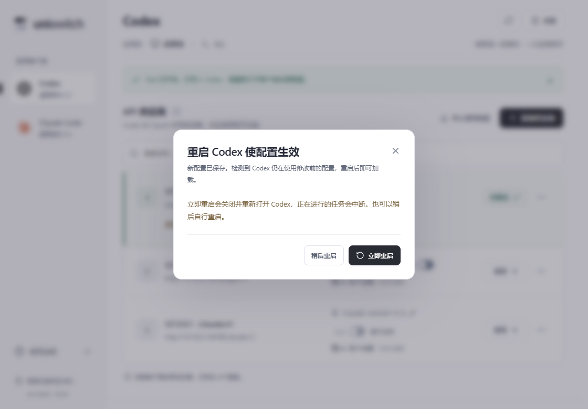

# 0.5.4 Codex 配置生效与重启选择

供应商应用、编辑并使用、Fast、模型/思考显示修改、同步和恢复原配置等操作真正写入 Codex 文件后，软件检查使用同一配置目录的 Codex 桌面实例。实例启动时间早于最后写入时间时，显示“重启 Codex 使配置生效”弹窗。

- **立即重启**：通过 Windows Restart Manager 请求匹配的 Codex 桌面应用正常退出，等待进程退出后，打开同一安装位置的桌面程序，并保留 CODEX_HOME 和自定义用户数据目录。只注册匹配的进程与创建时间，不使用强制退出标志。旧进程未退出时显示原因，重启失败不回滚已经成功保存的配置。
- **稍后重启**：保持 Codex 运行并关闭弹窗。同一次修改在当前 uni-switch 会话内不会因轮询重复弹出，后续新的写入再次提示。供应商行保留“待重启”和“重启 Codex”入口。关闭按钮与 Escape 按稍后处理，点击弹窗外侧不关闭。

按钮执行期间禁止重复点击和关闭弹窗，显示重启进度；失败保留弹窗、原因及稍后选项。初始焦点放在“稍后重启”，用户可以用键盘选择。弹窗说明重启会中断正在执行的任务。

匹配依据包含桌面安装来源、根进程、当前配置目录、进程创建时间和窗口。Windows Store Codex 的桌面文件名可以是 ChatGPT.exe，通过 OpenAI.Codex 包位置区别普通 ChatGPT。Codex CLI、app-server、Electron 子进程和其他配置目录不会作为自动重启目标。多个匹配实例或无法正常关闭的实例提供说明，用户可稍后手动重启。

配置版本只在实际文件变更后增加；只保存供应商、保存名称、应用完全相同的配置或写入失败不会制造新的重启提示。恢复配置也保留最后写入版本，即使目标已恢复为未接管状态。手动更换到另一配置目录时清除原目录版本，不把旧目录的写入误认为新目录需要重启。重启请求在服务端再次核对配置版本，旧版本的请求不会关闭进程。

自动重启目前支持 Windows。核对本机 Codex 26.930 的 Windows 客户端代码可见，关闭最后一个窗口会保留进程，因此使用 Windows 正常退出请求，而不是仅关闭窗口。原生验收使用自建隔离窗口，覆盖真实 Restart Manager 退出请求、等待退出、重新打开、中文用户数据目录、旧版本拒绝和退出失败；没有关闭或重启用户真实 Codex。

67 项前端测试、94 项 Rust 测试通过（1 项辅助进程测试按设计忽略）。28 组原生桌面流程通过，13 处 Axe 检查无违规，前端运行错误为 0。首次提示、稍后不重复、后续写入再提示、正常退出重开、拒绝退出、恢复配置和版本变更均有覆盖。正式包独立启动烟测因本机已有用户的 0.5.3 实例而未运行，保留了该实例。

TypeScript、前端生产构建和 Clippy 通过。Windows x64 正式安装包与单文件版已构建并交付，复制后的 SHA256 与构建产物一致。

