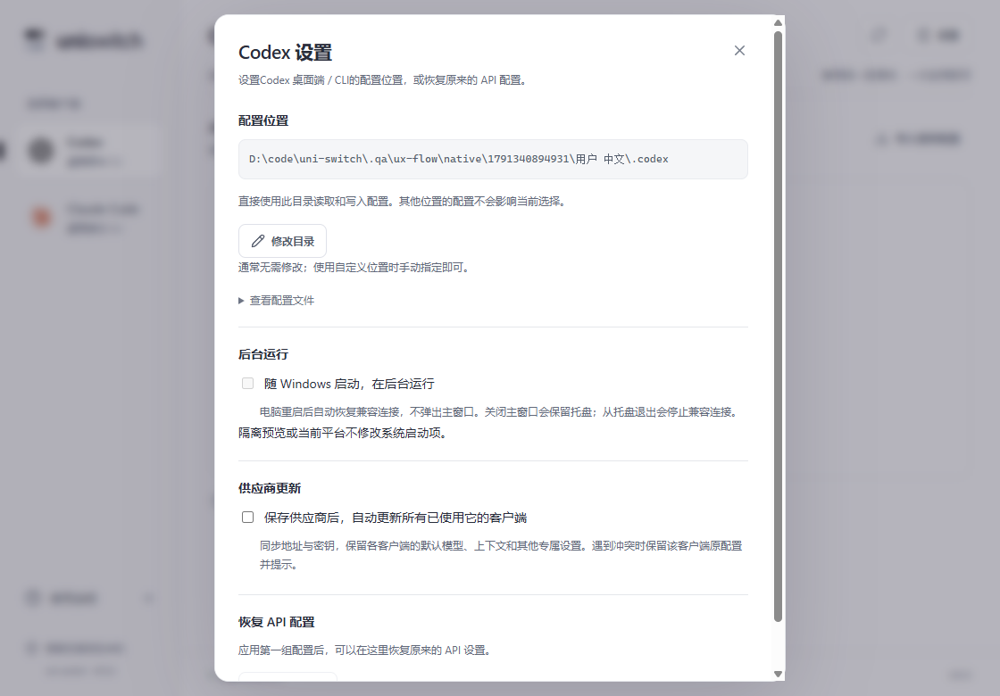

# 0.5.2 配置位置简化

目录使用当前已保存的位置，新安装使用对应客户端默认位置。Codex在未指定CODEX_HOME时为当前用户的`.codex`，例如`C:\Users\Administrator\.codex`；路径按当前系统用户生成，不固定Administrator账户。

主页面、供应商表单不再显示“确认配置位置”，不再显示搜索候选或搜索范围。设置仅展示当前目录、“修改目录”和折叠的配置文件列表。无需修改时直接添加和使用供应商即可。

启动、聚焦、目标切换、添加、使用和共享同步不调用目录搜索，也不因browser目录或其他配置副本而要求选择。后台自动确认及搜索的Tauri命令已移除，避免仅隐藏界面而保留原阻断流程。运行进程检查仍用于重启提示，不据此改变配置目录。

设置 → 修改目录：输入自定义绝对目录，点击保存后返回设置。取消、关闭或Escape返回设置，保留原目录；当前目录已经接管时，修改按钮禁用并说明需先恢复原配置。保存目录只更新位置记录，应用供应商时才写入配置。

当前目录的格式校验、外部修改保护、备份及可恢复事务保留。其他位置的配置不会被读取并参与目录选择，也不会被改写。

## 验证

前端覆盖目录不出现在主页面或添加表单、设置可见、无自动查找入口、手动修改确认与取消、已接管目录禁用修改。Rust回归覆盖`.codex/browser/config.toml`副本存在时只写当前目录，重开保持同一目录。

57项前端测试通过，85项Rust测试通过（1项辅助进程测试按设计忽略）。21组原生桌面流程通过，11处Axe检查无违规，前端运行错误为0。原生脚本同时验证了旧目录搜索与自动确认命令已经不可调用。验收使用隔离目录与本地模拟供应商，没有修改用户实际配置。

TypeScript、Clippy和正式安装包构建通过。

本轮正式版启动烟测未完成：本机正在运行用户的0.5.1独立版，生产单实例插件会将新启动交给原窗口。没有终止用户实例。0.5.2原生QA进程在独立目录中完整通过上述流程；正式安装包已生成。

