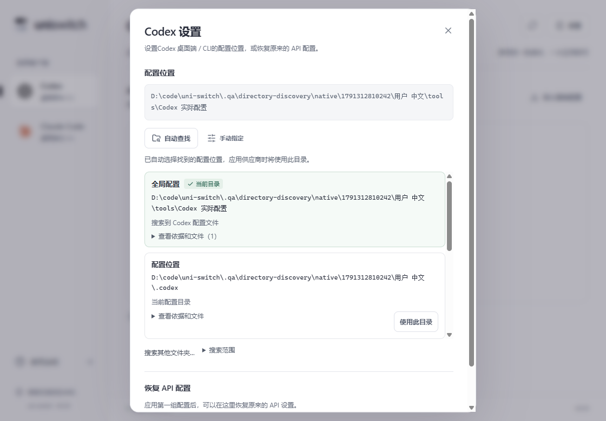

# 配置目录自动查找 · 0.3.9

> 0.5.2已取消目录自动搜索和确认。当前目录直接使用，仅在设置中查看和手动修改，见[配置位置简化](config-location.md)。下文保留为历史记录。

> 0.4.0 操作更新：默认两字段、自动推荐模型，协议与认证放在高级设置；编辑和修复先保存在草稿，点击“保存并使用”后一起写入，取消不会写入。启动已自动检查配置目录。本文下方旧版操作与截图保留为历史记录，最新流程见 [简化流程](simple-flow.md)。


打开右上角「设置」后，uni-switch 自动查找当前目标的配置目录。适用于 Codex 桌面端 / CLI、Claude Code 桌面端和 Claude CLI。一般无需输入目录路径。

## 操作方式

1. 选择客户端并打开「设置」，等待自动查找结束。
2. 只有一个明确结果、当前目录未被手动指定或接管时，自动选用该目录。
3. 多个候选时查看「当前目录」「推荐」及来源，点击「使用此目录」。展开「查看依据和文件」可查看文件名、进程来源及修改时间。
4. 客户端安装在其他位置时，点击「搜索其他文件夹…」，在系统文件夹选择器中选择大致位置，无需输入完整配置路径。扩大搜索只显示候选，不自动切换当前目录。
5. 「自动查找」可重新检查；「手动指定」保留高级用户的路径输入入口。

查找只读取文件与结构信息。选用目录只更新 uni-switch 的本地绑定，应用供应商时才写入客户端配置。原有手动目录和已接管目录不会因搜索被替换；已接管时更换前须恢复原配置。旧版自定义目录迁移为手动选择。



## 如何判断多个配置

| 线索                                                   | 含义                                                                                                                         | 行为                                           |
| ------------------------------------------------------ | ---------------------------------------------------------------------------------------------------------------------------- | ---------------------------------------------- |
| 可读取的 Windows x64 客户端进程                        | Codex 引擎 / CLI 的 CODEX_HOME 或用户默认目录；Claude CLI 的 CLAUDE_CONFIG_DIR 或默认目录；Claude 桌面明确的 --user-data-dir | 一个有效进程目录可自动选用；多个不同目录需选择 |
| uni-switch 继承的环境变量、Windows 用户 / 系统环境变量 | 指向自定义目录，但不证明已启动客户端使用该值                                                                                 | 只推荐，显示「待确认」；冲突时不自动选择       |
| Claude 桌面进程的 LOCALAPPDATA                         | 提供候选父目录，不能确定多个安装实例的实际子目录                                                                             | 作为待确认线索                                 |
| 唯一可读取的全局配置                                   | TOML / JSON 结构可解析，且没有冲突的明确线索                                                                                 | 未手动选择或接管时自动选用                     |
| 多个可读取的全局配置                                   | 可能是旧配置、另一安装实例或另一客户端环境                                                                                   | 列出候选，不根据修改时间自动决定               |
| 项目中的 .codex / .claude                              | 与全局配置叠加的局部配置                                                                                                     | 标注「项目局部配置」，不作为全局供应商写入目标 |
| 备份 / 归档目录                                        | 副本不代表当前客户端配置                                                                                                     | 标注「备份副本」，不自动选用                   |
| 损坏或无法读取的已发现配置                             | 不能安全写入                                                                                                                 | 显示原因，不自动选用                           |

「运行中的客户端使用」必须有进程证据；「全局配置」表示文件位置和结构符合规则，不等于推理请求已验证。目录正确也可能受到启动参数、项目设置或组织策略的覆盖。

Claude 桌面默认的 Claude / Claude-3p 作为一组配置处理，其他安装实例分别列出。配置库会检查 \_meta.json 当前选中的 profile，而不是按最新文件猜测。选择具体实例后，配置写入和恢复只针对该实例。自定义用户数据目录的重复文件路径会合并，避免一次事务写同一文件两次。

若 Codex 桌面端和 CLI 实际使用两个目录，会显示冲突。当前 Codex 目标一次绑定一个目录；要管理另一环境，需要先恢复当前目录再更换绑定。这版不同时接管两个不同的 Codex 目录。

## 搜索范围

检查当前目录、默认目录、环境与进程线索，以及用户目录、Local / Roaming 等常用位置。自动搜索最多向下三层；通过文件夹选择器扩大搜索时最多五层。每次搜索上限约三秒、12,000 个目录项，达到上限会提示继续搜索并关闭自动选择。

跳过缓存、node_modules、Git 对象、测试目录、构建目录和子级符号链接 / Windows 重解析点；不遍历整块硬盘。环境变量明确指向的位置即使在常用搜索范围之外也会检查。没有配置时可保留默认目录，在应用时创建。

这版验证 Windows x64。受权限限制或无法读取的进程不会被标为已确认；其他系统仅实现文件和环境线索，尚未进行发行验收。WSL、远程主机及容器内的目录不会自动映射为 Windows 目录。

前端和诊断结果只返回目录、文件名及判断依据，不返回配置内容、API Key、完整进程命令行或环境变量集合。

## 验证记录

验证日期：2026-10-07。全部写入使用隔离目录与合成密钥。

- 前端 37 个测试通过，覆盖自动选择、多候选手动选择、接管保护、额外搜索、失败重试。
- Rust 69 个测试通过，另有一个仅供父测试启动的 helper 默认忽略。包括实际启动隔离的 x64 客户端进程并读取中文 CODEX_HOME，验证路径正确且不返回其他凭据。
- Rust 测试覆盖多进程冲突、环境线索不视为生效证明、损坏 profile、路径去重、目录选择持久化、旧数据库迁移、过期搜索和已接管目录保护。
- 原生 Tauri 六组目录场景通过，验证真实 IPC、搜索不改写文件、自动绑定、多个配置、重启保留、Claude 实例应用与恢复、CLI 推荐和确认区别。
- 三个 Axe 场景零违规，包含键盘选择与 390px 窄窗口；没有页面异常或横向溢出。
- 模型同步七组、Codex 使用 Claude 六组、Claude 使用 GPT 五组回归通过，使用实际 Codex / Claude CLI 与本机模拟供应商。
- TypeScript / Vite、Clippy（-D warnings）和格式检查通过。Windows 发布程序与 NSIS 安装包已生成；发布程序隔离启动通过，数据库与窗口正常，未开放 QA 调试端口。

原生场景中的进程线索来自 QA fixture，以保证不依赖当前开发机正在运行的客户端；真实 Windows 进程读取由单独的 Rust 进程测试验证。QA 专用 fixture 与 WebView 调试端口不会加入发布版。

汇总结果、兼容性边界和发布文件 SHA-256 见 [验证数据](directory-discovery-validation.json)。

结果在 `.qa/directory-discovery/results.json`，脚本为 `scripts/qa-directory-discovery.mjs`。使用启用 qa-webview 的隔离测试程序复现：

```powershell
$env:UNI_SWITCH_QA_EXE = (Resolve-Path '.qa/directory-discovery/test-app/uni-switch.exe').Path
node scripts/qa-directory-discovery.mjs
```
