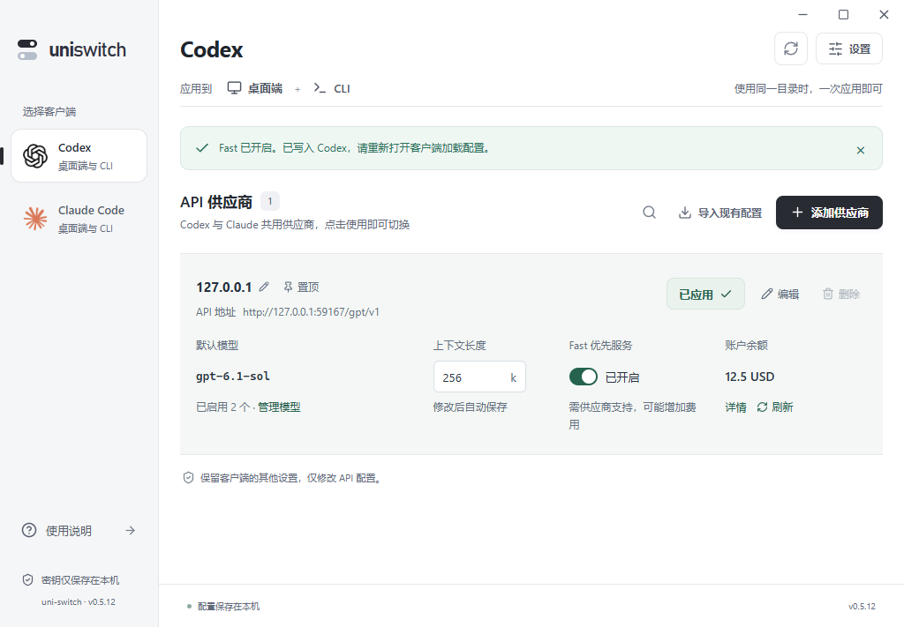

# 0.5.3 高级设置与 Fast 快捷开关

供应商添加和编辑表单中的高级设置固定展示，不再需要点击标题展开。名称、协议、认证、Fast、思考强度修复和余额查询保持可见；默认自动匹配和自动命名保留，因此首次添加仍只需要填写地址和密钥。模型列表仍可通过“更换模型”打开。

Codex 供应商列表在模型旁直接显示 Fast 开关。当前供应商切换 Fast 时，将 `service_tier` 写为 `priority` 或 `default`，并更新模型目录的 `additional_speed_tiers` 与 `service_tiers`。开关仅修改速度选项，保留客户端选择的模型、思考强度、上下文、已修复的思考选项和其他配置。已经保存但尚未应用的地址、密钥、模型修改不会由 Fast 开关顺带应用。

未用于 Codex 的供应商仅保存开关，下次使用时生效，不切换当前供应商。OpenAI 协议的共享供应商也能使用这个开关。Claude 协议转换暂不支持 Fast，列表禁用开关并显示“暂不支持”；Claude 客户端列表不展示 Codex 专用的开关。Fast 是否提供优先服务及收费规则取决于供应商，应用不通过付费推理探测来判断。

当前供应商写入通过既有备份、事务与回读校验执行，外部 API 或模型目录冲突时不保存开关、不覆盖文件。写入成功后需重新打开 Codex 加载配置。键盘 Tab 和空格可以操作开关，提交期间禁止重复点击，失败保留原状态并显示原因。

前端回归覆盖固定展示、默认接入、草稿取消、列表开关的键盘操作、提交禁用与失败回退。Rust 回归覆盖当前配置同步、模型元数据保留、恢复原配置、重开持久、非当前供应商保存、未应用修改保留、外部冲突和共享供应商；Codex Fast 不会让共用供应商的 Claude 目标误报待更新，也不会隐藏原本未同步的连接变更。60 项前端测试和 91 项 Rust 测试通过，1 项辅助进程测试按设计忽略；TypeScript、前端生产构建和 Clippy 通过。

24 组原生桌面流程通过，12 处 Axe 检查无违规，前端运行错误为 0。正式 Windows 安装包构建成功；正式包独立启动烟测因本机仍有用户的 0.5.2 实例而未运行，没有终止该实例。所有原生验证使用隔离目录和本地模拟供应商，没有修改真实客户端配置。

