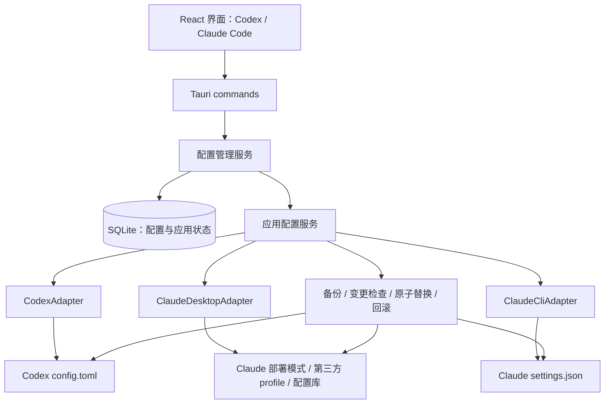

# uni-switch 第一版实施方案

编写日期：2026-10-06。

目标：沿用 cc-switch 的技术架构，做一个只管理 Codex 与 Claude Code API 配置的桌面应用。用户保存 Base URL、API Key 和模型后，可以选择配置并将其应用到客户端。

本文保留初始设计与验收目标，并已更新 Claude 桌面端的实现范围。根据用户澄清，Claude Code 指桌面客户端；第一版已将 Claude 桌面适配纳入，并保留 Claude CLI 目标。实际实现和验证情况见 [README](../README.md) 与 [验证记录](verification.md)，下列完整客户端推理验收目标尚未全部完成。

## 1. 产品范围与命名

第一版只包含两个业务模块：

1. Codex API 配置：覆盖经过验证的 Codex 桌面端和 Codex CLI。
2. Claude Code API 配置：覆盖 Claude Code 桌面客户端，并保留 `claude` 命令行客户端。

用户已明确“Claude Code”指桌面客户端，因此 Claude 页默认目标为桌面端，另有 CLI 目标。桌面端通过独立第三方推理 profile、配置库元数据及部署模式配置；CLI 单独写入 `~/.claude/settings.json`。

Codex 桌面端与 CLI 在使用同一个配置目录时共用配置。若 CLI 设置了其他 `CODEX_HOME`、运行在 WSL 或远程机器上，则视为另一配置环境。第一版优先支持 Windows 原生客户端；使用跨平台路径与文件接口，为 macOS / Linux 保留构建能力，未经验证的平台不标为已支持。

### 用户操作

- 查看、添加、编辑、删除 API 配置。
- 输入供应商名称、Base URL、API Key、模型 ID。
- 为 Codex 或 Claude Code 各自选择一个当前配置。
- 应用配置后，显示写入结果和重新启动客户端的提示。
- 读取并导入已有配置；遇到不支持的认证方式时显示原因，不猜测转换。
- 恢复接管前的 API 配置字段。

备份、语法校验、冲突检查、回滚属于配置切换的正确性保障，不增加独立管理中心。

### 明确排除

第一版不实现其他客户端、MCP 管理、Skills 管理、提示词管理、聊天与会话管理、OAuth 多账号管理、订阅管理、用量统计、测速排行榜、代理转发、协议转换、自动故障转移、云同步、插件市场、托盘快捷切换、自动更新和主题系统。

界面不暴露这些入口。模型由用户填写，不增加模型目录抓取和供应商预设库。

## 2. 技术栈

参考 cc-switch 当前仓库的 `package.json` 和 `src-tauri/Cargo.toml`。下面是主要架构的一致性要求，不要求复制它的全部依赖。

| 层次           | 选择                                          | 职责                                        |
| -------------- | --------------------------------------------- | ------------------------------------------- |
| 桌面运行时     | Tauri 2                                       | 窗口、IPC、安装包                           |
| 前端           | React 18 + TypeScript                         | 两个客户端的配置界面                        |
| 构建           | Vite + pnpm                                   | 开发与前端构建                              |
| 样式与组件     | Tailwind CSS 3 + shadcn/ui / Radix UI         | 表单、弹窗、卡片、状态反馈                  |
| 表单           | React Hook Form + Zod                         | 表单状态与输入校验                          |
| 数据请求状态   | TanStack Query                                | 调用 Tauri commands、缓存列表、刷新当前状态 |
| 本地业务后端   | Rust                                          | 路径解析、配置适配、文件写入、回滚          |
| 数据库         | SQLite + rusqlite                             | 保存配置、绑定目录、记录应用状态            |
| TOML           | toml_edit                                     | 修改 Codex API 字段并保留现有注释           |
| JSON           | serde / serde_json                            | 解析与合并 Claude Code 配置                 |
| 错误与文件工具 | thiserror、tempfile、dirs、uuid、sha2         | 统一错误、临时文件、路径、ID、变更检测      |
| 验证           | Vitest + Testing Library、Rust 单元及集成测试 | UI 行为与真实文件操作                       |

前端通过 Tauri IPC 调用 Rust。数据库和客户端配置文件都由 Rust 访问，不让前端拥有任意文件读写权限。

第一版没有本地 HTTP 服务，也不需要独立 Node 服务、Axum 代理、云服务或账号系统。若后续在已有表单内增加手动连通性验证，可沿用 cc-switch 的 reqwest；当前第一版不依赖这个扩展。

## 3. 总体架构



API 请求由 Codex 或 Claude 客户端直接发送给供应商。uni-switch 退出后，已经写入的配置仍然可供客户端使用。

### 模块划分

- `ProviderService`：配置增删改查。保存配置不自动切换。
- `ApplyService`：生成配置补丁、协调文件写入与数据库状态。
- `CodexAdapter`：识别目标版本、解析 TOML、生成 Codex 补丁。
- `ClaudeDesktopAdapter`：生成部署模式、第三方推理 profile 与配置库补丁。
- `ClaudeCliAdapter`：解析 JSON、选择认证变量、生成用户级 CLI 补丁。
- `PathResolver`：解析客户端实际配置目录。
- `FileWriter`：同目录临时文件、权限、原子替换、回读校验。
- `BackupService`：保存接管前字段、操作前文件及恢复记录。
- `StateInspector`：比较保存的配置与当前文件，报告外部变更。

三个目标分别实现读取、导入、校验、生成补丁和检查应用结果，当前代码集中在 `src-tauri/src/adapters.rs`。适配器只管理明确列出的 API 字段，不重新生成整个客户端配置文件。

## 4. Codex 配置方案

### 目标目录

| 环境           | 默认文件                           |
| -------------- | ---------------------------------- |
| Windows 原生   | `%USERPROFILE%\.codex\config.toml` |
| macOS / Linux  | `~/.codex/config.toml`             |
| 显式自定义目录 | `<实际 CODEX_HOME>/config.toml`    |

目录选择规则：用户为该目标显式绑定的目录优先；其次是确认属于目标客户端的 `CODEX_HOME`；最后使用默认目录。uni-switch 进程继承的环境变量只能作为线索，不能代替对目标桌面端或 CLI 的配置目录确认。

当 Codex 桌面端和 CLI 指向同一目录时，只需一次文件写入。指向不同目录时分别应用，并清楚展示目标路径，不能宣称一次切换覆盖所有环境。

### 当前版本的认证变化

本次读取的 cc-switch 源码 `src-tauri/src/live/project/codex.rs` 明确注明：Codex 0.149 起，自定义 provider 不再读取 `auth.json` 中的 API Key，cc-switch 将密钥写入 provider 的 `experimental_bearer_token`。

因此，第一版必须先确定一组经过实测的 Codex CLI 与桌面端内置引擎版本，再确定写入模板。不能只检测用户安装的 CLI 版本，就推定桌面端内置引擎的版本相同。

计划默认支持经过验证的现代 provider 配置。旧版 `auth.json` 模式单独属于旧版本适配；第一版不自动为未知版本写入旧格式。遇到未知或不支持版本时返回明确状态，不虚报兼容性。

以下仅是无官方登录状态下的现代配置结构示例，具体字段以第一阶段实测为准：

```toml
model = "your-model-id"
model_provider = "uni_switch"

[model_providers.uni_switch]
name = "My API"
base_url = "https://api.example.com/v1"
wire_api = "responses"
experimental_bearer_token = "YOUR_API_KEY"
requires_openai_auth = false
```

管理字段：

- `model`、`model_provider`。
- 可选的 `model_reasoning_effort`，仅在用户选择且版本支持时写入。
- `[model_providers.uni_switch]` 中的名称、地址、协议和认证字段。

使用固定的 `uni_switch` provider ID，减少切换时 provider 名称变化对既有会话使用的干扰；第一版不实现会话历史迁移。

`requires_openai_auth` 不能永久硬编码。cc-switch 当前逻辑会结合自定义凭据来源与已有官方登录状态计算该值；桌面端的登录界面行为也受其影响。第一阶段必须覆盖无登录、已有官方登录以及实际使用的凭据存储模式，验证 API 请求使用的是用户选择的 Key。

`auth.json` 和系统凭据库中的官方登录材料不作为本应用的 API 配置写入目标，也不用于第三方请求的回退认证。默认保留原有登录，恢复时还原接管前的路由字段即可；若测试发现某版本必须额外修改认证文件，则先记录兼容性结论并修改方案，不直接扩大写入范围。

### 协议要求

第一版要求供应商支持 Codex 使用的 OpenAI Responses 协议及所需的流式和工具调用。只有 Chat Completions 接口的服务不算 Codex 兼容服务。

保存 Base URL 时保留供应商给出的路径前缀，仅做必要格式校验和尾部斜杠规范化，不猜测并重写路径。界面示例说明 Codex 地址常包含 `/v1`，最终以供应商的 Codex 接入地址为准。

应用后建议重新启动 Codex 桌面端，CLI 开启新进程/会话。第一版不承诺正在进行的任务无缝切换 API。

## 5. Claude Code 配置方案

### 桌面端（默认目标，已实现）

Windows 默认父目录为 `%LOCALAPPDATA%`，可手动绑定。uni-switch 管理以下四个文件：

| 文件                                                                | 托管内容                                                       |
| ------------------------------------------------------------------- | -------------------------------------------------------------- |
| `Claude/claude_desktop_config.json`                                 | `deploymentMode = "3p"`                                        |
| `Claude-3p/claude_desktop_config.json`                              | `deploymentMode = "3p"`                                        |
| `Claude-3p/configLibrary/e82de475-47fa-4c54-9000-13571c000001.json` | 独立 Gateway profile 的地址、Key、认证模式、模型与静态凭据配置 |
| `Claude-3p/configLibrary/_meta.json`                                | 注册独立 profile 并设置 `appliedId`                            |

桌面端不通过 CLI 的 `settings.json` 接入。需要支持第三方推理的 Claude Desktop 版本，使用完整 Claude 模型 ID；当前关闭模型发现并设置明确模型。所有托管字段保留原值用于恢复，MCP 与无关配置继续保留。四文件操作通过 pending 记录处理部分写入与中断恢复。

### CLI（独立目标，已实现）

默认目标是 `~/.claude/settings.json`；Windows 为 `%USERPROFILE%\.claude\settings.json`。支持用户绑定的目录及客户端实际使用的 `CLAUDE_CONFIG_DIR`。

示例：

```json
{
  "env": {
    "ANTHROPIC_BASE_URL": "https://api.example.com",
    "ANTHROPIC_AUTH_TOKEN": "YOUR_GATEWAY_TOKEN",
    "ANTHROPIC_MODEL": "your-model-id"
  }
}
```

认证方式必须允许用户选择：

| 供应商要求   | 写入字段               | HTTP 认证语义               |
| ------------ | ---------------------- | --------------------------- |
| Bearer Token | `ANTHROPIC_AUTH_TOKEN` | `Authorization: Bearer ...` |
| API Key      | `ANTHROPIC_API_KEY`    | `x-api-key`                 |

默认表单可使用 Bearer Token，适合常见第三方网关；官方 Anthropic API 或要求 `x-api-key` 的服务使用 API Key。不能将两种模式视为等价。

切换认证方式时，处理本应用管理范围内另一认证变量的残留，避免旧凭据抢占新配置。不删除 OAuth 登录文件，不自动伪造初始化或登录状态；客户端要求的首次确认由客户端处理，并在兼容性验收中记录。

管理字段限于 Base URL、选定认证字段、默认模型，以及用户明确填写的模型别名映射。常用别名为 Sonnet、Opus、Haiku，具体显示哪些别名以已验证客户端版本为准。

Claude 配置使用结构化 JSON 合并，保留原有 `permissions`、`hooks`、`mcpServers`、插件配置和无关 `env` 项。原文件语法不合法时停止写入，并显示错误位置；不使用空对象覆盖损坏文件。

第一版只管理用户级设置。项目级、项目本地、启动参数和组织 managed settings 可能改变最终值。界面展示实际写入的文件，保留“待客户端确认”状态；用户可用 Claude Code 的 `/status` 核查最终 Base URL 和凭据来源。不要将环境变量简单视为一个固定优先级层级，实际规则按变量及设置项确定。

供应商必须兼容 Anthropic Messages 协议，以及 Claude Code 所需的流式和工具调用。服务只提供 OpenAI 格式时，第一版不做协议转换。

桌面端与 CLI 可以复用同一组已保存的 API 配置，但分别应用、记录当前状态与恢复。桌面模式不支持的模型会被拒绝应用，不自动进行协议转换。

## 6. 配置应用、备份与恢复

一次应用操作按以下顺序执行：

1. 确认目标目录、客户端兼容性、输入字段及配置语法。
2. 获取该目标的应用锁，读取当前文件及摘要。
3. 在内存中生成字段补丁；首次接管时保存原始 API 字段，含字段原先不存在的状态。
4. 保存操作前文件到私有备份目录，并在 SQLite 写入 pending 操作及恢复所需信息。
5. 将新文件写入目标同目录的临时文件，设置权限并 flush。
6. 替换前再比较目标摘要；若出现外部修改则停止并重新生成补丁。
7. 原子替换目标文件，回读并验证语法和托管字段。
8. 在数据库事务中更新当前配置指针与文件摘要，标记操作完成。
9. 返回写入状态和重启提示。

文件系统替换与 SQLite 提交不是一个原子事务，必须使用 pending 操作记录解决两者不同步。启动时发现 pending，通过文件摘要判断应用到了哪一步，完成提交或恢复到操作前状态；不能只在异常处理中尝试回滚。

第一版默认一次操作只应用一个客户端配置目标，避免把 Codex 与 Claude 两个独立文件错误地当成一次原子事务。重复点击和并发操作通过应用锁控制。

Windows 必须验证原子覆盖已有文件的实现及文件被占用的情况，不能使用“删除原文件后再 rename”的不可靠流程。使用同目录临时文件和经过 Windows 验证的替换策略，必要时调用 `ReplaceFileW` / `MoveFileExW`。文件锁失败时保留原文件并返回可理解的错误。

完整文件备份用于单次操作失败恢复；用户点击“恢复原配置”时只还原接管前的 API 字段，保留接管后新增的其他设置。恢复时若托管字段已被其他工具修改，先报告冲突，不静默覆盖。

不需要增加通用备份浏览器。保留首次接管记录和最近少量操作备份，清理策略只处理本应用自己的备份目录。

### 状态展示

- “已写入”：文件语法与托管字段校验通过。
- “待重启/确认”：客户端进程可能仍使用旧配置。
- “外部变更”：当前文件与保存的托管字段不一致。
- “写入失败/待恢复”：保留清楚的原因及恢复入口。

“配置已写入”不能表示已实际调用成功。前端的当前配置标记结合文件检查与数据库状态，不只读取数据库里的 active 标记。

### 密钥处理

第一版沿用本地 SQLite 保存配置的方式。客户端配置文件本身会包含 API 凭据，因此数据库、临时文件和备份都放在当前用户私有位置，Windows 检查 ACL，Unix 设置适当的私有权限。

API Key 默认遮罩，日志和错误信息不输出密钥，不把实际配置备份保存进代码仓库。不增加密钥管理平台和云端加密同步功能。

## 7. 数据结构与 IPC

建议仅保留三个小型数据实体：

| 实体               | 核心字段                                                                                             |
| ------------------ | ---------------------------------------------------------------------------------------------------- |
| `providers`        | `id`、`app_type`、`name`、`base_url`、`api_key`、`auth_mode`、`model`、`options_json`、创建/更新时间 |
| `targets`          | `id`、`app_type`、`config_dir`、`active_provider_id`、`last_applied_digest`、接管前 API 字段记录     |
| `apply_operations` | `id`、`target_id`、`provider_id`、`status`、写入前/目标摘要、备份位置、错误和时间                    |

实际实现将配置产品分类为 `codex` 与 `claude`，应用目标为 `codex`、`claude_desktop` 与 `claude_cli`。每个目标拥有独立当前配置，切换 Codex 不改变 Claude 配置，Claude 桌面端和 CLI 的状态互不覆盖。

默认每个产品只显示一个目标目录；`targets` 提供路径绑定和恢复记录，不在第一版增加复杂的多环境管理界面。

编辑配置先保存到数据库；应用操作由明确的“应用”按钮触发。删除正在使用的配置前，要求用户先选择其他配置或恢复原配置，保证客户端文件和管理状态一致。

建议的 Tauri commands：

```text
list_providers(app_type)
save_provider(provider)
delete_provider(provider_id)
inspect_target(app_type)
set_target_directory(app_type, directory)
import_current_config(app_type)
apply_provider(app_type, provider_id)
restore_original_config(app_type)
```

返回结构化错误，区分输入无效、配置语法错误、路径无权限、外部变更、客户端不兼容、文件占用与恢复失败。前端不展示 Rust 堆栈。

## 8. 界面方案

主窗口顶部两个标签：`Codex`、`Claude Code`。内容区域仅有当前配置状态、目标路径、供应商列表，以及“添加配置”“导入现有配置”“恢复原配置”操作。

供应商卡片显示名称、Base URL、模型和当前状态；操作为“应用”“编辑”“删除”。应用成功后更新状态，并在同一个页面显示客户端重启提示。

添加/编辑弹窗：

- 共用必填字段：名称、Base URL、API Key、模型 ID。
- Codex：协议固定为 Responses，可选推理强度在受支持版本下展示。
- Claude Code：认证模式选择，模型别名映射放在可展开区域。

路径设置放在现有状态区的“修改目录”弹窗，不建设独立设置中心。表单提供字段标签、键盘操作和错误说明。

不照搬 cc-switch 的完整导航、供应商库或复杂模式选择器。

## 9. 当前工程结构

```text
uni-switch/
├── docs/implementation-plan.md
├── docs/verification.md
├── scripts/
│   ├── with-msvc.ps1
│   ├── qa-browser.mjs
│   ├── qa-desktop.mjs
│   └── qa-codex-cli.mjs
├── src/
│   ├── App.tsx
│   ├── components/
│   │   ├── Modal.tsx
│   │   └── ProviderForm.tsx
│   ├── lib/api.ts
│   ├── lib/schema.ts
│   ├── types.ts
│   └── styles.css
├── src-tauri/
│   ├── Cargo.toml
│   ├── tauri.conf.json
│   ├── capabilities/
│   └── src/
│       ├── lib.rs
│       ├── main.rs
│       ├── types.rs
│       ├── adapters.rs
│       ├── store.rs
│       ├── store/tests.rs
│       ├── writer.rs
│       └── error.rs
└── release/windows-x64/
```

为了控制第一版规模，配置服务、数据库与操作恢复集中在 `store.rs`，文件适配集中在 `adapters.rs`；未增加独立 HTTP 服务或通用客户端管理框架。

## 10. 实施顺序与验收

下表为开发前的阶段划分与工期估算。现在工程、功能、隔离验证及 Windows 打包已经完成，真实供应商与桌面客户端推理的待验收项以验证记录为准。

| 阶段           | 交付内容                                                                      | 预计时间 |
| -------------- | ----------------------------------------------------------------------------- | -------- |
| 1. 兼容性验证  | 确定目标 Codex 桌面/CLI、Claude 桌面/CLI 版本；验证路径、认证、模型、重启行为 | 1–2 天   |
| 2. 工程与存储  | Tauri / React 工程、SQLite、IPC、两个标签页                                   | 1 天     |
| 3. 配置管理 UI | 配置增删改查、表单、状态显示、现有配置导入                                    | 1–2 天   |
| 4. 核心适配    | Codex 与 Claude Code 字段补丁、文件写入、版本和路径处理                       | 2–3 天   |
| 5. 可靠性验证  | 原子替换、pending 恢复、备份、冲突和配置保留测试                              | 2 天     |
| 6. 发布验证    | Windows 安装包及桌面/CLI 目标的端到端验收                                     | 1–2 天   |

阶段 1 优先完成，避免 UI 已做完才发现桌面端认证模板不兼容。最终最低版本根据实测公布，不把 cc-switch 源码中的版本注释直接当成 uni-switch 的验收结果。

### 首版必须通过的验收

1. Codex 配置 A 切到 B 后，目标 CLI 新进程使用 B 的地址、Key 和模型；同目录桌面端重新启动后也使用 B。
2. Codex CLI 与桌面端版本分别验证；安装了新 CLI 不代表桌面内置引擎一定兼容。
3. 有官方登录与无官方登录两种状态下，自定义 Codex 请求都使用选定 API Key，不把官方 token 发给第三方。
4. Claude Code 认证模式在 Bearer 与 API Key 之间切换后，`/status` 和实际请求符合选择，旧认证变量不干扰。
5. 模型配置与协议兼容：完成一次流式回复和一次工具调用；只验证保存成功不足以通过验收。
6. 保存未应用的配置不会改变客户端；Codex 与 Claude 当前配置相互独立。
7. 原有 Codex TOML 的 MCP、项目设置、注释，以及 Claude JSON 的权限、hooks、插件和无关环境项被保留。
8. 已有配置损坏时拒绝写入；外部工具同时修改配置时报告冲突。
9. 中文用户名、带空格目录、自定义配置目录、文件不存在、文件占用和无权限都有正确结果。
10. 模拟替换失败、数据库提交失败和进程中断，重启后能恢复一致状态。
11. “恢复原配置”恢复接管前 API 字段，同时保留用户后续新增的无关设置。
12. 应用日志与打包产物不包含实际测试密钥。

自动测试使用临时目录和模拟客户端文件，不修改开发者真实配置。真实 API 验收由明确选择的测试凭据完成，不在配置应用时自动发送计费请求。

## 11. 与 cc-switch 的复用关系

采用相同技术栈，在新工程中实现两个最小适配器。可以参考或小范围复用 cc-switch 的字段投影、路径处理、文件替换和数据库访问思路。

避免先复制整个项目再逐个删除其他模块。当前 cc-switch 包含代理、聚合、OAuth、会话及多客户端依赖，复制完整应用会扩大第一版维护面。

cc-switch 使用 MIT License；若直接复制其源文件或实质性代码片段，应保留原版权与许可证声明。

## 12. 参考依据与待验证项

参考 cc-switch main 分支提交 `d4a2410772103c7f303e16397c3946340d84a450`（2026-10-06）。本次读取的 manifest 标注版本为 4.0.2，不据此声称其已发布版本。

- [cc-switch 项目](https://github.com/farion1231/cc-switch)
- [前端依赖与构建脚本](https://github.com/farion1231/cc-switch/blob/d4a2410772103c7f303e16397c3946340d84a450/package.json)
- [Rust / Tauri 依赖](https://github.com/farion1231/cc-switch/blob/d4a2410772103c7f303e16397c3946340d84a450/src-tauri/Cargo.toml)
- [Codex 字段投影与认证变化](https://github.com/farion1231/cc-switch/blob/d4a2410772103c7f303e16397c3946340d84a450/src-tauri/src/live/project/codex.rs)
- [Codex 写入流程](https://github.com/farion1231/cc-switch/blob/d4a2410772103c7f303e16397c3946340d84a450/src-tauri/src/services/provider/codex_direct.rs)
- [Claude Code 写入流程](https://github.com/farion1231/cc-switch/blob/d4a2410772103c7f303e16397c3946340d84a450/src-tauri/src/services/provider/claude_direct.rs)
- [文件替换及路径实现](https://github.com/farion1231/cc-switch/blob/d4a2410772103c7f303e16397c3946340d84a450/src-tauri/src/config.rs)
- [Claude Code 设置文件与优先级](https://code.claude.com/docs/en/settings)
- [Claude Code 网关连接、认证方式和桌面差异](https://code.claude.com/docs/en/llm-gateway-connect)
- [Claude Code 环境变量](https://code.claude.com/docs/en/env-vars)

本次尝试访问 OpenAI Docs 的 Codex 配置与桌面设置页面时，文档站返回访问限制。Codex 模板依据 cc-switch 已读取源码；现在已用实际 Codex CLI 0.160.0 完成本地模拟 Responses 流式请求，并验证合成无登录/已有登录状态使用所选 Key。尚未完成桌面内置引擎、真实登录与真实供应商推理验收，不能将这些项目标为已通过。
