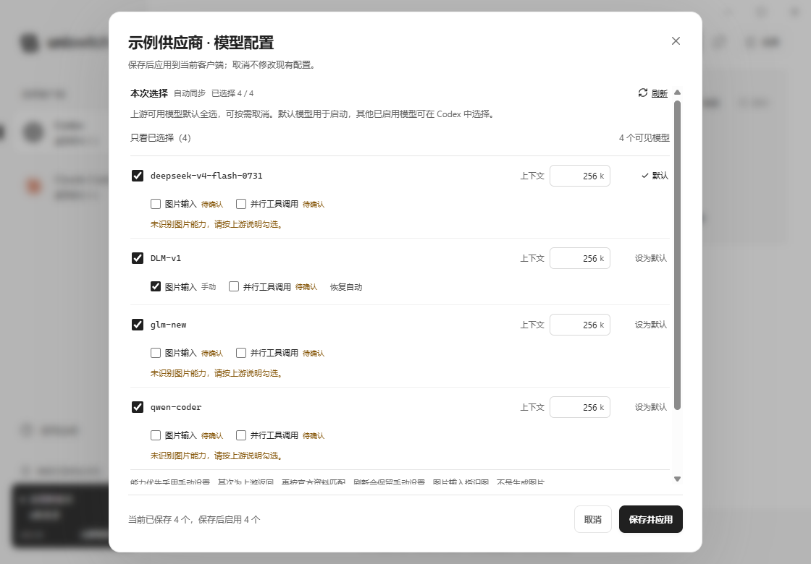

# 模型能力与图片输入修复

适用版本：v0.5.21（能力分层改造，待发布）。返回 [教程](tutorial.md#models) 或 [项目首页](../README.md)。

0.5.18 及之前生成的 Codex 目录按接口协议决定输入模态：OpenAI 协议一律只写 text，Claude 协议一律写 text + image。这会让有视觉能力的 GPT 在请求发送前就被 Codex 拒绝。0.5.19 改为按每个模型的实际能力写入。

## 如何使用

1. 点击供应商行的「管理模型」，等待自动同步。
2. 每个模型下方都有「图片输入」；Codex 还显示「并行工具调用」。官方型号通常自动匹配，未知型号显示「待确认」。图片输入指理解图片，不是图片生成。
3. 需要覆盖时直接勾选或取消；出现「手动」标记。点击「恢复自动」清除该模型的所有手动能力覆盖。
4. 点击「保存并应用」，按提示重启 Codex，并用新会话测试。未使用供应商只保存，下次使用时生效。

## 自动识别的顺序

| 优先级 | 来源 | 说明 |
| --- | --- | --- |
| 1 | 用户手动覆盖 | 支持明确开启或关闭；刷新同一个模型不会覆盖 |
| 2 | 上游明确元数据 | 识别 input_modalities、modalities.input、OpenRouter architecture.input_modalities、Anthropic capabilities.image_input.supported，以及明确的 image / parallel 布尔字段；false 也有效 |
| 3 | 经核实的资料目录 | 前后端共用 [同一份目录](../src/content/model-capabilities.json)，核实日期 2026-10-08；支持独立签名更新和离线缓存 |
| 4 | 无法识别 | 不凭协议、任意名称或未来型号猜测，显示待确认，允许手动配置 |

匹配仅使用明确收录的型号及官方快照，允许 openai/、anthropic/、google/、deepseek/ 命名空间。不把私有映射、任意自定义后缀或未发布型号自动认成官方能力。同步只使用供应商当前返回的模型，内置资料不会向可用列表添加模型。

当前资料覆盖 GPT-6 Astra、GPT-6.1 Sol、GPT-6 Sol / Luna、GPT-5.6 各档、GPT-5.5 / 5.4、GPT-4o / 4.1、多个历史 GPT / o 系列以及 Claude Fable 5.1、Opus / Sonnet 5.5、4.5 / 4.6 等。也收录已核实的 Gemini 和 DeepSeek Flash。保留 GPT-3.5、原始 GPT-4、o3-mini、o1-mini 等纯文本例外；不会声称所有 GPT 都支持图片。

未知能力默认关闭不是已证实不支持。供应商明确返回仅文本时优先采用该结果；确认网关实际支持后可手动覆盖。未核实的并行工具能力同样可手动设定。未来模型可通过上游元数据、签名资料更新或手动设置使用，不必只依赖名称白名单。

## 档案、转换与接入验证

展开单个模型的「接口、思考参数与接入验证」可查看 Messages / Chat Completions / Responses 的独立声明，以及工具、结构化输出、思考格式、上限、来源与更新时间。缺失资料显示「待确认」，不等于不支持；HTTP 200 或模型名称本身也不证明接口实现完整。上游明确的 `false`、空思考档位列表优先于官方资料。

- 新增 Haiku 5.5 和 DeepSeek V4.1 Flash 档案。Haiku 5.5 转换采用自适应思考，不再发送 `budget_tokens`；DeepSeek 按其参数约定映射档位，并保留 Chat 工具轮次需要的思考历史。旧 Claude 4.5 仍采用预算思考。
- 未知型号不猜测 Claude 思考格式。需要转换且资料不足时返回明确配置提示，可手动选自适应、预算、DeepSeek 或 OpenAI 格式，也可选不支持思考；刷新保留覆盖，「恢复自动」同时清除能力和思考模式覆盖。
- 接口类型检测优先使用 `supported_endpoint_types` 并合并分页声明，不只凭 `/models` 外形或名称判断。对于 OpenAI → Claude 转换，明确只支持 Chat、不支持 Responses 的接入直接走 Chat；500 不自动切换协议，避免重复计费和掩盖请求问题。
- 验证必须显式勾选可能计费的确认项；每次只发送一个合成文本、32×32 红色图片、合成工具声明或流式请求，最多请求 256 个输出 Token。不发送会话或文件、不执行工具、不重试，也不自动覆盖设置。只有语义匹配且流式正常结束才记为本次通过；500、认证失败、超时或无效回复都保留「待确认」。观察结果保存在应用私有数据目录的 `model-verifications` 中，不含密钥或响应原文。浏览器预览禁止验证。

**保持原样的两项行为：** Codex 模型目录仍提供全部八档思考菜单；档案只用于展示与转换映射，不缩减菜单。现有上下文同步仍保留旧值或使用 256K 默认值；档案上下文仅供展示，不自动覆盖或拆分手动值。

## 独立资料更新

设置中的「模型能力资料」显示资料核实日期及最近成功检查时间。发布者配置签名源后，每天检查一次；也可手动更新。要求 HTTPS、Ed25519 签名、固定公钥、版本单调递增和严格格式；不跟随重定向。无网络、无效签名、低版本或同版本不同内容都保留原资料。缓存再次启动时仍验签，不能直接加载未签名 JSON。更新过程不会写客户端配置；重新同步模型并保存可更新客户端模型目录。转换服务使用最新官方资料作低优先级回退，上游声明及手动覆盖始终优先。

当前 `release-config.json` 的 `modelRegistry` 为 `null`，因此**没有可用的生产远程资料源**。界面明确提示未配置，并继续使用内置和上游资料；不会误报「已是最新」。发布维护步骤及签名工具见 [签名资料维护](model-registry-maintenance.md)。

## 升级与兼容

启动时只修复仍与上次应用快照相符的受管模型目录，用原有事务、备份和配置修订机制落盘；不改 API Key、当前模型、上下文或其他目录元数据。真实写入会触发 Codex 重启提示，无变化不反复提示。未使用供应商在下次应用时采用新规则。

存在外部修改、损坏文件或冲突时跳过自动修复，保留原有冲突处理；不会强制接管文件。Fast、模型保存和思考强度修复都按同一能力规则生成或修复目录，避免旧 text-only 标记回来。恢复原配置继续使用最初的受管快照。

Claude 原生客户端的菜单和输入由自身及上游管理。图片能力元数据在供应商间、客户端间复用；OpenAI → Claude 的本地转换服务发布能力信息并尊重明确关闭的图片能力。两方向转换保留图片内容，但不能使真实纯文本模型获得视觉能力。

## 官方依据

每条目录记录保存其官方来源：

- [OpenAI 模型目录](https://developers.openai.com/api/docs/models/all)、各型号页面的 Input modalities / Snapshots，以及 [工具调用说明](https://developers.openai.com/api/docs/guides/function-calling)。
- [Codex 官方模型目录](https://github.com/openai/codex/blob/main/codex-rs/models-manager/models.json)，包含 input_modalities 和 supports_parallel_tool_calls。
- [Claude 模型比较](https://platform.claude.com/docs/en/models/overview)、各型号 Overview 中的 Text and images → text，以及 [并行工具说明](https://platform.claude.com/docs/en/agents-and-tools/tool-use/parallel-tool-use)。
- [Gemini 图片理解](https://ai.google.dev/gemini-api/docs/image-understanding)。
- [DeepSeek Vision](https://api-docs.deepseek.com/guides/vision/)。

验证结果与限制见 [QA 记录](qa-inventory.md)。Codex 验证使用真实独立 app-server 和本地 mock 上游，包含图片请求；不使用用户真实密钥，不产生付费调用，也不声称测试过每家真实中转站。
