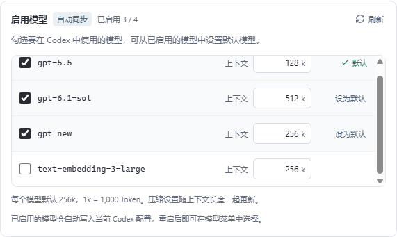

# 每个模型的上下文与自动写入 · 0.3.6

> 0.4.0 操作更新：默认两字段、自动推荐模型，协议与认证放在高级设置；编辑和修复先保存在草稿，点击“保存并使用”后一起写入，取消不会写入。启动已自动检查配置目录。本文下方旧版操作与截图保留为历史记录，最新流程见 [简化流程](simple-flow.md)。

上下文长度位于 Codex 模型列表的每一行，默认 **256k**。输入框使用 k，1k = 1,000 Token；支持最多三位小数，范围为 0.001–100000k。旧配置已有模型上下文或全局上下文时保留原来的有效值，刷新继续保留手动修改，新增模型使用 256k。这个默认值是用户指定的配置，不代表供应商返回的能力上限。

“更多选项”移除上下文和自动压缩阈值输入，只保留名称、列表修复与 Fast。模型目录为每个启用模型写入相同的 `context_window`、`max_context_window` 和 `auto_compact_token_limit`。新版表单及自动写入流程移除全局 `model_context_window` 和 `model_auto_compact_token_limit` 覆盖，避免切换模型后仍使用上一模型的长度。旧配置不在启动时自动改写，恢复原配置仍可还原旧全局值。

Codex 自身仍预留部分窗口：本机 0.160.0 的可用输入窗口默认是配置的 95%，实际压缩触发上限为窗口的 90%。这两项是客户端内部处理；填写相同的上下文和压缩值不会绕过它们，也不会增加网关实际支持的长度。

## 自动写入行为

- 新建或未应用的供应商：填写地址和 Key 自动同步，勾选模型并调整长度；“保存并应用”自动写入所选 Codex 目录。仅保存不会切换当前供应商。
- 当前已应用的供应商：编辑窗口明确提示模型修改立即生效。同步成功后，模型勾选、默认模型、上下文变化经 500 毫秒防抖自动写入，显示写入结果，无需再次保存。取消窗口不会撤回已自动写入的模型修改，完整撤回使用“恢复原配置”。
- API 地址、Key 或认证方式正在修改时：暂停自动写入，等待“保存并应用”，避免把另一连接的模型写给当前供应商。
- 新同步到的模型会列在表单里，只有勾选启用的模型进入 Codex 菜单；新发现的模型保持未启用，保留原先勾选与默认模型。

自动写入同时更新供应商模型记录、模型目录和配置管理状态，沿用数据库事务、备份、原子替换与中断恢复。后端重新确认供应商仍然正在应用、连接匹配、模型与长度有效、API 文件无外部修改。外部冲突或写入失败会显示原因与重试入口，不报告成功。它保留 Codex 已选择的有效模型、思考强度和服务档位；用户在 uni-switch 明确改变默认模型时更新默认模型。

Codex 的自定义模型目录在启动时加载。写入成功后需要完全退出并重新打开桌面端；CLI 开启新进程。软件不自动重启正在使用的客户端。

## 验证

- 30 项前端测试与 39 项 Rust 测试通过，TypeScript/Vite 构建和 Clippy `-D warnings` 通过。覆盖长度校验、防抖、连接变更取消、失败与重试、首次接管和恢复、外部文件保护与未应用供应商不写入。
- 原生 `scripts/qa-auto-models.mjs` 执行 7 组流程，覆盖模型独立编辑、刷新保留、自动写入、Claude 桌面/CLI 回归，以及 1120、760、390 宽度的布局与 Axe 检查。截图为 `docs/screenshots/model-context-section.png` 和 `model-context-narrow.png`。
- `scripts/qa-codex-model-runtime.mjs` 使用本机真实 Codex 0.160.0，独立 CODEX_HOME、独立数据库、本地模拟供应商和虚构密钥。实际 `model/list` 返回三个启用模型；同一会话执行三个回合并切换模型，`thread/tokenUsage/updated` 分别返回对应的输入窗口：

| 模型 | 写入的上下文 | Codex 返回的可用输入窗口 |
| --- | ---: | ---: |
| gpt-5.5 | 128,000 | 121,600 |
| gpt-6.1-sol | 512,000 | 486,400 |
| gpt-new | 256,000 | 243,200 |

结果与 Codex 的 95% 预留规则一致，证明切换模型后读取各自上下文。实际目录内每个模型的压缩字段与上下文相等，全局覆盖已移除。记录见 `.qa/auto-models/native/codex-runtime.json`。

- 思考强度修复 7 组、自动余额 9 组回归通过，正式包隔离启动检查通过。验证均不修改用户真实配置，不使用真实供应商或用户密钥；未操作运行中的 Codex 桌面菜单。

