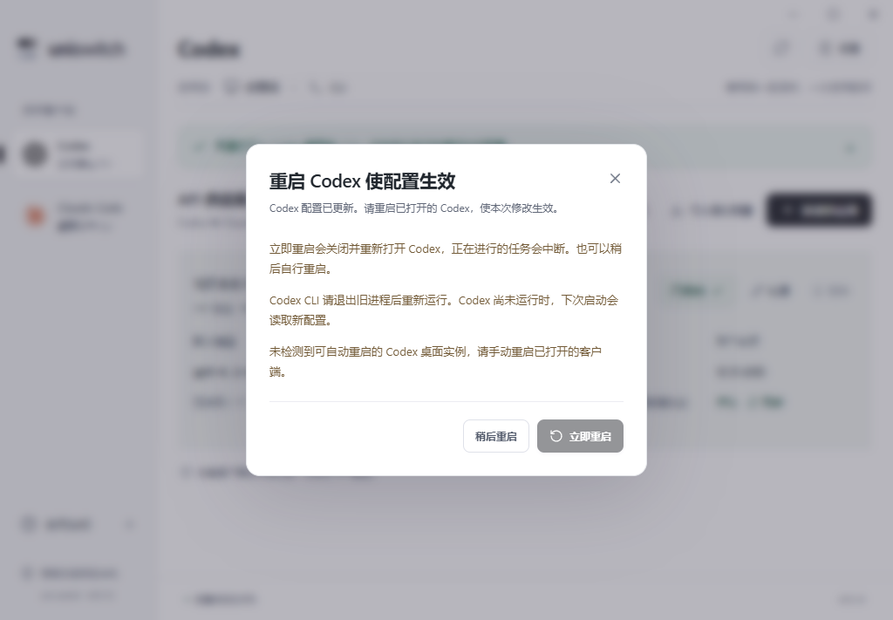

# 0.5.6 模型列表固定展示与 Codex 修改后重启提示

添加和编辑供应商的模型区域固定展示，取消 `
` 折叠、箭头和展开操作。自动同步的模型勾选、默认模型设置与每模型上下文直接可用；上下文仍默认256k，压缩值与上下文同步。大列表保留搜索、只看已启用及分批显示，已勾选状态不因筛选而丢失。点击供应商行中的模型名仍直接定位模型区域并聚焦。

模型、上下文及其他编辑仍为草稿，点击确认按钮后才写入。取消、Escape或关闭表单不会保存修改。去除折叠后，表单滚动和底部确认按钮保持原行为。

Codex配置每次实际写入修改后都弹出“重启 Codex 使配置生效”，提供“立即重启 / 稍后重启”。适用于模型启用、默认模型、上下文、思考显示修复、Fast、供应商应用、共享同步和恢复原配置。只保存到供应商库、取消、无实际文件变化以及写入失败不作为新的配置修改。

后端在配置状态中返回 `configurationRevision`，仅真实客户端文件变化才推进。前端从配置状态识别新版本，提示不再要求成功检测到运行中的Codex桌面端；进程检查失败时仍会显示提示。首次读取历史写入和手动更换配置目录不会被当作本次修改。运行检查与写入检查同时发现同一版本时只提示一次。

识别到可正常重启的匹配桌面实例时，“立即重启”执行原有正常退出重开。没有可确认实例时仍显示两个选项，禁用自动重启并解释手动处理方式；CLI请退出旧进程后重新运行，Codex尚未运行时下次启动读取新配置。弹窗使用“配置已更新”文案，不将未检测到的进程描述为正在使用旧配置。

选择稍后保持客户端运行，同次修改在当前uni-switch会话中不因轮询反复提示。下一次实际写入再次弹窗。编辑或设置弹窗尚未关闭时，提示等原弹窗结束后再展示。Claude桌面端与CLI延续0.5.5的重启流程。

## 验证与交付

83项前端测试、99项Rust测试通过（1项辅助进程测试按设计忽略），TypeScript、前端生产构建、Rust格式检查与Clippy通过。32组原生使用流程与16处Axe检查通过，无违规和前端运行错误。

验证覆盖固定展示、列表快捷焦点、窄窗口、模型及上下文确认后提示、取消不写入、未检测到桌面进程仍提示、进程检查失败仍提示、重复轮询不重弹、下一次实际修改再提示以及恢复原配置。原有Codex正常退出重开和Claude两端的重启流程也通过隔离回归。

Windows x64安装包与单文件版已构建并交付到 `release/windows-x64`，校验文件为 `SHA256SUMS-0.5.6.txt`。原生验收使用隔离目录、桌面窗口与CLI进程，用户正在运行的0.5.5和真实Codex保持原样；正式包独立启动烟测因用户旧版实例仍在运行而未执行。

