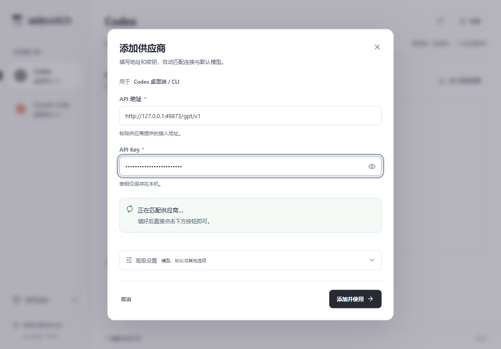
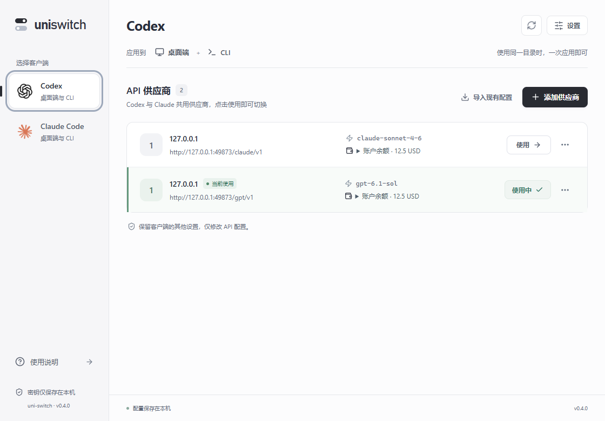
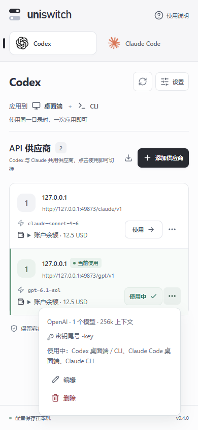

# 0.4.0 简化流程与共享供应商

本文保留0.4.0的历史行为。当前0.5.0的独立模型入口、共享更新、后台启动和验收结果见[使用体验整改记录](ux-flow.md)。

验收标准：首次接入只填写 API 地址、API Key，点击一个“添加并使用”；日常切换点击一次“使用”；常规接入不打开高级设置。

## 表单与确认

默认展示两项输入、自动匹配结果、折叠高级设置和一个提交按钮。新建为“添加并使用”，正在使用的供应商编辑为“保存并使用”，未使用供应商编辑为“保存修改”。名称来自地址，协议和认证自动匹配，初次模型自动推荐。主按钮可在后台探测开始前点击，也可直接按 Enter。

地址、密钥、模型启用、默认模型、每模型上下文、Fast、思考修复都保存在表单草稿；取消、Escape 和关闭弹窗不写入供应商或客户端。模型刷新及余额查询只读取上游。确认使用时，供应商数据与客户端文件通过同一可恢复日志提交，失败保留旧数据和表单。

高级设置提供协议 / 认证覆盖、名称、模型勾选与上下文、Fast、思考修复和只保存选项。Codex 每模型默认 256k，压缩值同步为该模型上下文；确认后重启加载。取消不再出现旧版实时写模型后无法撤回的问题。

## 共享记录与独立目标

Codex 和 Claude 读取同一供应商列表，不按创建页面分开存储。旧记录保留 ID 和密钥，不自动合并历史重复记录。明确的上游协议与目标客户端分开：同一个 GPT 供应商用于 Claude 时自动转换，同一个原生 Claude 供应商用于 Codex 时自动转换。

三个目标各自保留目录、生效 ID、备份、确认时间及转换快照。编辑当前目标时更新供应商和当前目标，其他已使用目标保留原快照并提示待应用修改，点击其“使用”再更新。取消或保存草稿不会改变正在发出的转换请求。

## 启动、列表与服务

左侧保留官方 Logo，右侧列表展示名称、地址、默认模型、余额和“使用”；额外信息及编辑删除收进“…”菜单。菜单支持键盘、Escape、返回焦点；底部空间不足时向上展开。余额前台约每分钟和聚焦时刷新，短期缓存与最多三家并发保留，详情默认折叠。

客户端和 Claude 桌面 / CLI 目标记在本机，重开继续上次位置。启动和首次切换目标自动查找配置目录；手动绑定、已经接管及多个有效目录不会自动覆盖。无法明确判断时提示进入设置查看来源。

Windows 读取匹配目录的客户端进程创建时间，与最后确认时间比较，提示新会话 / 重启。权限不足、路径无法确定时不声称已热更新。

转换服务随应用运行，关闭窗口保留托盘；进程内服务失败重试，固定端口占用每 2 秒重试原端口与令牌。不可用时拒绝新的转换使用操作，配置保留。电脑重启后需打开 uni-switch，本版没有注册系统开机启动。

## 自动识别边界

自动匹配只使用模型查询，认证仅在 401 / 403 后尝试另一方式，429 等错误停止。OpenAI schema 标记优先于分页字段，Claude 原生标记用于识别 Messages。通用模型列表或同时支持多个协议的网关不能仅凭模型 ID 证明推理兼容，保留高级覆盖。不会自动发送计费推理请求。

余额范围沿用站点接口：New API 开放的 API Key 接口可能给账户余额或密钥额度，按结果范围展示；不能取得时提示不可用，不填零或虚构账户余额。

## 原生验收

脚本 `scripts/qa-simple-flow.mjs` 在隔离数据、中文配置目录、本地模拟上游与假密钥下验证：

1. 启动找到实际配置目录，未接入时不写客户端文件。
2. 只显示两个字段、一个提交按钮，自动推荐模型、余额和名称；无推理探测或重复模型请求。
3. 改地址、密钥、模型、上下文、Fast、思考修复后取消；供应商摘要、SQLite 主文件 / WAL、主配置和模型目录保持原内容。
4. 确认启用两模型后，真实 Codex 0.160 读取 128k / 512k、同一会话切换模型，思考列表包含 max。
5. Enter 接入原生 Claude，认证自动回退到 x-api-key，在 Codex 自动生成转换路由；列表一次“使用”切换。
6. 同一 ID 用于 Codex、Claude 桌面和 CLI，模型菜单写真实 GPT 名称，各目标分别使用。
7. 外部修改使确认失败时旧数据不变，重试不重复添加，其他目标保留原生效密钥。
8. 重开记住 Claude CLI；转换端口占用时应用启动、拒绝错误使用，释放后恢复原端口和令牌。
9. 精简表单、列表、菜单及 390px 布局无横向溢出，七处 Axe 检查零违规，无页面错误。

结果位于 `.qa/simple-flow/results.json`，真实 Codex 结果在该文件指向的隔离运行目录中。协议回归使用 `scripts/qa-protocol-bridge.mjs` 和 `scripts/qa-reverse-bridge.mjs`，覆盖真实 Codex / Claude CLI 的工具调用与会话历史。完整统计以最终运行输出为准。

截图：

最终代码检查：前端36项通过，Rust79项通过（另1项是供父测试启动的忽略辅助进程），Clippy通过。真实Codex协议回归6组、真实Claude CLI反向回归5组通过；均使用隔离目录与本地模拟供应商，不代表所有真实供应商已经验收。Windows正式安装包另做启动、数据库初始化与QA调试端口关闭检查。
