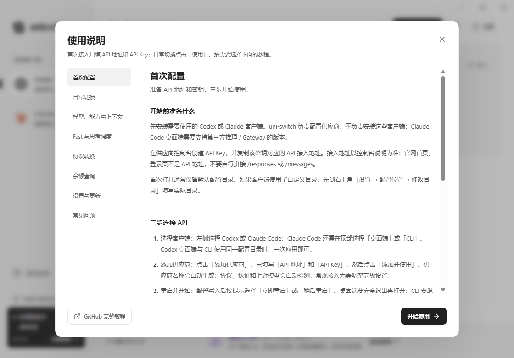

<!-- Generated by scripts/generate-tutorial.mjs from src/content/tutorial.json. -->
# uni-switch 使用教程

适用版本：**v0.5.19** · Windows x64

首次接入只填 API 地址和 API Key；日常切换点击「使用」。按需要选择下面的教程。

[下载最新程序](https://github.com/dieqiyun/uni-switch/releases/latest) · [返回项目首页](../README.md) · [供应商赞助名单](sponsors.md) · [反馈问题](https://github.com/dieqiyun/uni-switch/issues)

## 教程目录

- [首次配置](#getting-started)
- [日常切换](#providers)
- [模型、能力与上下文](#models)
- [Fast 与思考强度](#fast-reasoning)
- [协议转换](#protocols)
- [余额查询](#balance)
- [设置与更新](#settings-updates)
- [常见问题](#troubleshooting)

## 首次配置

准备 API 地址和密钥，三步开始使用。

### 开始前准备什么

先安装需要使用的 Codex 或 Claude 客户端。uni-switch 负责配置供应商，不负责安装这些客户端；Claude Code 桌面端需要支持第三方推理 / Gateway 的版本。

在供应商控制台创建 API Key，并复制该密钥对应的 API 接入地址。接入地址以控制台说明为准：官网首页、登录页不是 API 地址，不要自行拼接 /responses 或 /messages。

首次打开通常保留默认配置目录。如果客户端使用了自定义目录，先到右上角「设置 → 配置位置 → 修改目录」填写实际目录。

### 三步连接 API

1. 选择客户端：左侧选择 Codex 或 Claude Code；Claude Code 还需在顶部选择「桌面端」或「CLI」。Codex 桌面端与 CLI 使用同一配置目录时，一次应用即可。
2. 添加供应商：点击「添加供应商」，只填写「API 地址」和「API Key」，然后点击「添加并使用」。供应商名称会自动生成；协议、认证和上游模型会自动检测，常规接入无需调整高级设置。
3. 重启并开始：配置写入后按提示选择「立即重启」或「稍后重启」。桌面端要完全退出再打开；CLI 要退出旧进程再启动。重启后在客户端选择模型，发送一条自己的测试消息。

### 第一次添加会自动完成什么

- 获取密钥可访问的上游模型；首次同步默认全选，上下文默认 256k。模型范围仍受客户端和转换能力约束。
- 在需要时启用本地协议转换；写入前备份受管配置，Codex 同时写入模型目录并检查思考强度菜单。
- 自动尝试查询余额和探测站点类型；余额接口不支持不影响配置接入。
- 「已写入配置」表示本地文件写入并校验成功。检测不会自动发送计费推理请求，实际聊天可用性由客户端、上游权限和网络共同决定。

### 蝶祈云接入示例

从蝶祈云官网进入控制台，创建或复制你的 API Key，查看对应渠道给出的 API 接入地址；将这两项填入 uni-switch 后点击「添加并使用」。不要直接把官网首页当作 API 地址。

密钥只在你自己的电脑输入。教程不要求提供密码、真实 Key、控制台 Access Token 或用户 ID。余额如果只返回密钥额度，界面会标明查询范围。

## 日常切换

供应商共享，一次点击应用到当前目标。

### 切换与跨客户端复用

1. 选择左侧客户端；Claude 再选择桌面端或 CLI。
2. 在供应商列表找到需要的供应商，点击行内「使用」。
3. 按重启提示加载新配置。切换另一个客户端时，可直接使用同一供应商，不必重复添加地址和 Key。

### 在列表完成常用操作

- 默认模型：点击行内模型控件打开「模型配置」，选择默认模型并确认保存。
- 上下文：Codex 列表可直接修改当前默认模型的上下文；其他模型到「管理模型」中逐个修改。
- Fast 加速模式、协议转换：直接使用行内开关，条件不满足时会显示原因。
- 余额：自动刷新，点击余额详情查看范围，点击刷新按钮重新查询。
- 置顶和搜索：常用供应商可以置顶，搜索可匹配名称、地址、模型和密钥尾号；Ctrl+F 打开搜索。
- 名称、地址、Key 或特殊认证：点击编辑按钮修改，留空 Key 会保留原密钥；取消不提交草稿。

### 哪些修改会立即应用

当前使用的供应商修改模型或 Fast 后，确认保存会写入当前目标并提示重启。未使用的供应商只保存偏好，下次点击「使用」时应用。

地址和 Key 可在多个客户端共享。「设置 → 供应商更新」控制保存后是否自动更新其他已使用它的客户端；同步连接信息会保留各客户端的模型、上下文等专属设置。有待同步提示时，可以点击「同步其他客户端」。

不同客户端和 Claude 的桌面 / CLI 分别记录应用状态。一个客户端显示「已应用」，不代表其他客户端也已切换。

### 删除供应商

供应商仍被任一客户端使用时不能删除。先为这些客户端使用其他供应商，或在对应客户端设置中恢复原配置，再删除。

## 模型、能力与上下文

自动同步模型和能力，确认保存后写入客户端。

### 管理模型

1. 点击供应商行的「管理模型」（或默认模型控件），打开模型配置弹窗。
2. 等待自动同步，也可点击「刷新模型列表」。首次同步和新出现的模型默认启用；仍存在模型保留你之前的启用选择和上下文。
3. 按需要勾选模型、选择默认模型，设置每个模型的上下文长度。Codex 默认是 256k，输入 512 表示 512k，即 512,000 tokens。
4. 当前供应商点击「保存并应用」；未使用供应商点击「保存模型配置」。需要时重启客户端。

### 图片输入与模型能力

每个模型下方直接显示「图片输入」；Codex 还显示「并行工具调用」。勾选图片输入表示客户端可以发送图片用于识图，不表示模型可以生成图片。

能力按「手动设置 → 上游明确返回 → 内置官方资料」的优先级确定。界面标注手动、上游返回、自动匹配或待确认；不会仅因使用 OpenAI / Claude 协议就推断所有模型支持图片。

能可靠匹配的当前 GPT、Claude、Gemini 等模型自动填入能力。模型改名、自定义别名、未来新型号或资料不足时显示「待确认」，默认关闭未确认的能力，请按照供应商说明手动勾选。手动配置不会给上游增加本来没有的能力。

刷新模型会保留仍在列表中模型的手动设置，也会更新上游返回的能力。点击该模型旁的「恢复自动」清除手动覆盖；点击取消则整个草稿不保存。

已使用供应商点击「保存并应用」，按弹窗重启 Codex；未使用供应商先保存，下次使用时生效。支持图片的 GPT 模型会写入 text + image，而不是旧版的 text-only。

升级到本版后，未被外部修改的受管 Codex 模型目录会自动检查、修复旧图片标记，并弹出重启提示；密钥、默认模型、上下文和其他配置保持原样。

能力配置用于 Codex 模型目录以及本地 OpenAI → Claude 转换服务；原生 Claude 的输入能力和菜单由客户端及上游管理。内置资料随软件更新；上游返回明确能力时可以在刷新模型时直接更新。

### 同步、取消和下架模型

弹窗中的刷新、勾选和修改均为草稿。点击「取消」或按 Escape，不修改供应商记录和客户端文件。

同步成功后只展示最新上游列表；上游不再返回的模型会从草稿中移除，失效默认模型会选择有效替代项。确认保存后才更新已保存列表和客户端目录。同步失败会保留原列表。

至少保留一个可用于当前客户端的模型，并确保默认模型已启用。不能通过手写模型 ID 获得密钥没有的模型权限。

### Codex 如何识别模型

应用到 Codex 时，uni-switch 会生成该配置目录下的 uni-switch-models.json，并将 model_catalog_json 写入 config.toml。重启 Codex 后，它会从这份目录读取已启用模型。

每个模型分别保存上下文长度。上下文是配置上限，不能扩大上游实际能力；不再提供独立的自动压缩阈值输入，相关写入与上下文联动。

如果模型列表仍旧，先确认已经保存并应用，再完全重启 Codex，并检查 Codex 实际使用的配置目录。

### Claude 的模型选择

Claude 桌面端和 CLI 使用各自支持的模型设置。OpenAI 转 Claude 时，本地转换服务会处理模型别名；上游模型 ID 仍保存在供应商中。客户端菜单形式和支持范围取决于 Claude 版本，不保证与 Codex 模型菜单完全相同。

## Fast 与思考强度

Fast 在列表开关，思考强度自动检查。

### Fast 加速模式

在 Codex 供应商行打开「Fast 加速模式」开关。当前供应商会立即保存并应用；未使用供应商在下次使用时生效。

Fast 请求上游的优先服务档位，只有供应商支持时才会生效，可能增加费用。它不保证固定加速倍数，也不能让不支持的渠道获得加速。

Claude Messages 转 Codex 的路径暂不支持 Fast；界面会禁用开关并说明原因。高级设置中的「跟随客户端」可保留客户端自身选择。

### 思考强度列表自动检查

每次写入 Codex 配置时，软件会自动检查并补齐模型目录中的思考强度显示信息，无需点击修复按钮。修改后重启 Codex，重新查看思考强度菜单。

补齐菜单不代表上游支持所有档位。max、ultra 等非标准档位的实际行为取决于模型、供应商和客户端版本；菜单名称不能保证真实推理能力。

如果菜单仍不完整，请先检查使用的配置目录、Codex 版本和已启用模型，再重启。不要单凭菜单判断渠道模型质量。

## 协议转换

看清上游协议，跨协议时保持后台运行。

### 自动检测与行内开关

供应商行会显示自动检测的「OpenAI」或「Claude」协议；检测未完成时保留检测状态。常规供应商无需手动选择协议和认证。

Codex 使用 Claude 协议时，列表显示「转换为 OpenAI」开关；Claude 使用 OpenAI 协议时，显示「转换为 Claude」开关。同协议直接连接时不需要转换。

未使用供应商打开转换开关只保存偏好，再点击「使用」应用。当前使用的跨协议供应商关闭转换时会恢复该目标原配置并提示重启；转换关闭后不能在该目标继续使用这个不匹配的供应商。

### 转换生效条件

- 本地服务把客户端请求和流式响应转换为上游支持的协议，并处理工具调用和模型别名。上游仍需提供所需推理接口，只有 /models 列表并不能保证聊天可用。
- 请保持 uni-switch 在运行。关闭主窗口会驻留托盘，转换继续工作；从托盘彻底退出、关机或服务不可用时，依赖本地转换的请求会中断。
- 可在「设置」启用随 Windows 后台启动。后台兼容服务健康状态异常时先打开软件，等待恢复，再重试。
- 协议转换不保证复现另一家客户端的全部原生特性；Fast、联网搜索、多模态和专有工具等能力受当前转换实现及上游支持限制。

### 自动检测不符合供应商文档

先核对地址和密钥是否属于同一渠道，再在编辑页面已展开的「高级设置」中指定 API 协议和认证。Bearer Token 和 x-api-key 以供应商文档为准。不确定时保留自动匹配。

## 余额查询

自动探测类型，区分账户余额与密钥额度。

### 无需开启或选择站点

添加供应商后会自动尝试查询余额，列表每分钟刷新，也可点击刷新按钮。软件自动探测兼容接口，不要求选择 New API、Sub2API 等站点类型。

点击余额详情查看来源、单位、更新时间和范围。账户余额、密钥剩余额度、订阅额度、限额不是同一个概念，必须按界面标注理解。

### 为什么有时无法显示账户余额

只靠 API Key 能查询到什么由站点实现和密钥权限决定。有的接口返回密钥额度，有的兼容接口返回账户或订阅信息，有的仅允许控制台认证。

New API / Sub2API 的不同版本与站点配置可能有差异；软件自动探测不会突破权限，也不会把密钥额度冒充钱包余额。

「暂不支持余额查询」「余额查询无权限」「余额更新失败」不表示余额为 0，也不一定表示聊天接口不可用。当前流程不要求你额外填写控制台 Access Token 或用户 ID；需要时到供应商控制台查看准确余额。

## 设置与更新

目录、恢复、后台运行和 GitHub 检查更新。

### 配置位置

右上角「设置」中查看和修改当前目标的配置目录。默认目录由客户端常用位置与相关环境变量确定；不提供自动搜索按钮。

通常直接使用默认目录。确实使用多个目录时，应选择当前启动进程实际读取的那个目录；不要仅凭文件最近修改时间判断。已接管目录要先恢复原配置，才能更换。

Codex 桌面端与 CLI 使用相同目录时共享配置；不同目录、启动参数或组织策略可能让实际加载结果不同。Claude 桌面端与 CLI 分别管理。

### 恢复原配置

1. 选择要恢复的客户端和目标，打开「设置」。
2. 点击「恢复原配置」，阅读确认提示后确认。
3. 按提示重启目标客户端。恢复只还原 uni-switch 管理的 API 相关字段，尽量保留其他设置。

写入前会保留接管前的受管字段快照。如果其他工具后来修改了受管字段或模型目录，软件会阻止覆盖；处理方法见「常见问题」。

### 关闭窗口、退出和开机启动

关闭主窗口后继续驻留托盘。需要彻底退出时，从托盘菜单退出；使用协议转换时应保持软件运行。

「设置」可以开启随 Windows 后台启动，适合依赖转换服务的用户。更新前从托盘退出旧版，避免旧进程继续运行。

### 检查与安装更新

1. 点击左下角版本号，打开「检查更新」。软件也会在启动时检测 GitHub 最新正式版。
2. 发现新版时，左下角持续显示「发现新版本」、新版本号与「立即更新」。点击提醒查看更新说明，再打开 GitHub 发布页，下载 Windows x64 安装包（推荐）或便携包。
3. 从托盘退出旧版，安装或解压新版后重新打开。当前更新功能不会自动替换正在运行的程序。

网络错误或 GitHub 限流时可以稍后重试；未成功读取最新版本不能视为已经是最新版。源码、许可证和 SHA256 校验值也在发布页提供。

## 常见问题

按照界面提示排查，保护现有配置和密钥。

### 连接错误怎么处理

| 现象 | 处理方法 |
| --- | --- |
| 401 / 密钥未通过验证 | 重新复制完整 API Key，检查是否过期、撤销或与当前地址属于同一站点。 |
| 403 / 无权限 | 检查密钥模型权限、分组、IP 限制或账户状态。 |
| 404 / 405 / 未找到模型接口 | 使用控制台给出的 API 接入地址，不要填官网首页或拼接具体推理端点。 |
| 429 / 暂时限制请求 | 等待后重试，检查供应商并发和频率限制。 |
| 网络失败或超时 | 检查地址可达性、系统代理和供应商状态；填写内容会保留。 |
| 没有可用模型 | 检查 /models 是否开放、密钥是否有模型权限、协议与认证是否符合供应商文档。 |
| 配置已写入但请求失败 | 重启并核对实际配置目录；转换时保持 uni-switch 运行。模型同步成功不能代替真实推理验证。 |

### 配置被其他工具修改

1. 先暂停其他切换工具的自动写入，并自行备份当前配置文件。
2. 点击「查看配置」确认目标、目录和涉及文件。在执行修改的工具中撤回它对 API 相关字段或模型目录的修改，使这些受管内容回到 uni-switch 上次成功应用后的状态。不要删除整个配置目录或本地数据库。
3. 回到 uni-switch 刷新状态，重新点击「使用」；需要回到接管前状态时再到设置中点击「恢复原配置」。若无法确定需要撤回哪些内容，先保留文件并反馈问题。

uni-switch 不再提供现有配置导入或自动接管外部变更。存在冲突时不会强制覆盖文件，恢复原配置也会被阻止，直到相关外部变更被撤回。

如果你想使用外部配置中的另一组 API，请在列表手动添加该供应商地址和 Key；添加记录本身不会解除当前目录的冲突。

### 支持图片的 GPT 提示不允许图片输入

1. 升级到 v0.5.19 或更新版本。正常受管目录会自动修复；如存在外部修改，先按冲突提示处理，程序不会覆盖外部文件。
2. 打开该供应商的模型配置，查看对应模型的「图片输入」。官方模型应自动匹配；自定义别名需要按上游说明手动启用。
3. 点击「保存并应用」，完整退出并重新启动 Codex，再新建会话测试图片。旧会话可能保留原模型能力。

如果上游明确返回仅文本，它会优先于内置资料。确认供应商实际支持图片后可手动覆盖。如果错误来自上游响应，需检查该模型、密钥分组和中转接口的真实图片支持；客户端能力设置本身不能改变上游能力。

### 模型或配置没有更新

- 确认点击了「保存并应用」，不是取消或仅保存到未使用供应商。
- 完全退出对应桌面客户端再打开；CLI 退出原进程再启动，已有会话可能仍保留旧配置。
- 检查当前目标、有效配置目录和启动参数，确认没有另一工具继续覆盖。
- 最新上游模型列表不再包含的模型，会在同步后移除；如供应商刚调整权限，可稍后刷新。

### 反馈问题与保护密钥

反馈时提供软件版本、客户端版本、目标类型、经过脱敏的报错和操作步骤。不要公开 API Key、登录密码、完整配置文件或本地数据库。

供应商密钥和配置保存在本机，不因「本机保存」而自动加密；请保护账户、备份和配置目录。GitHub 更新检查、源码和教程跳转不附带供应商密钥。

可在 GitHub 仓库的 Issues 反馈。软件内教程随版本打包，可离线查看；GitHub 教程包含当前版本说明和截图。

## 在线资料

- [蝶祈云官网与控制台入口](https://www.dieqiyun.top/)
- [GitHub Releases 与下载附件](https://github.com/dieqiyun/uni-switch/releases/latest)
- [更新记录](../CHANGELOG.md)
- [配置与隔离验证说明](qa-inventory.md)

本文与软件内「使用说明」共用一份内容。维护时修改 `src/content/tutorial.json`，运行 `corepack pnpm docs:generate`；`corepack pnpm docs:check` 检查两端说明是否一致。
