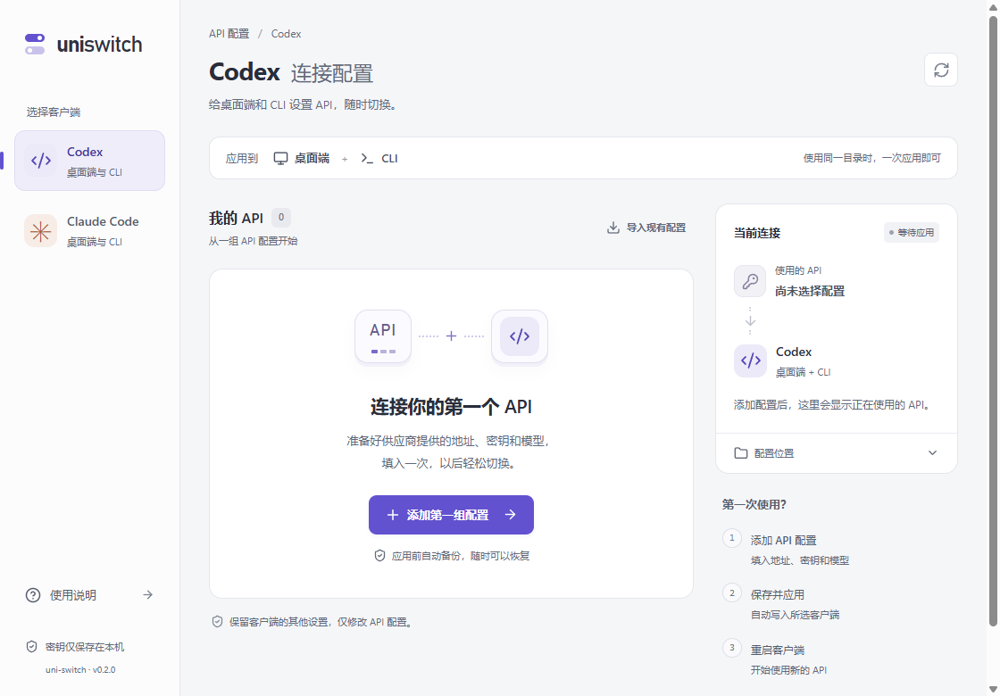
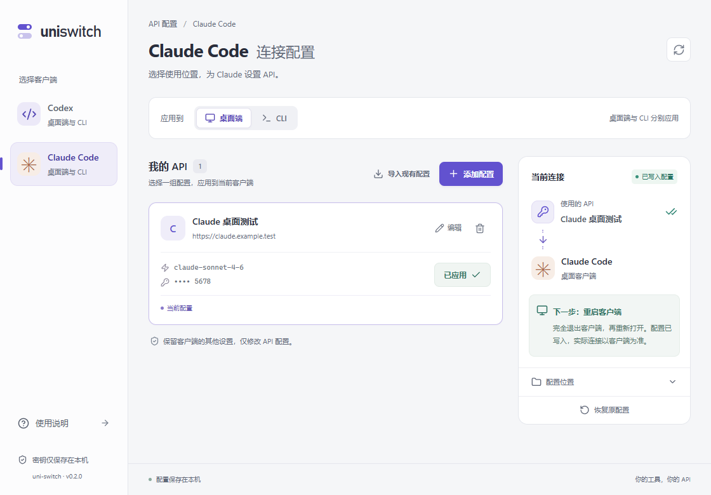
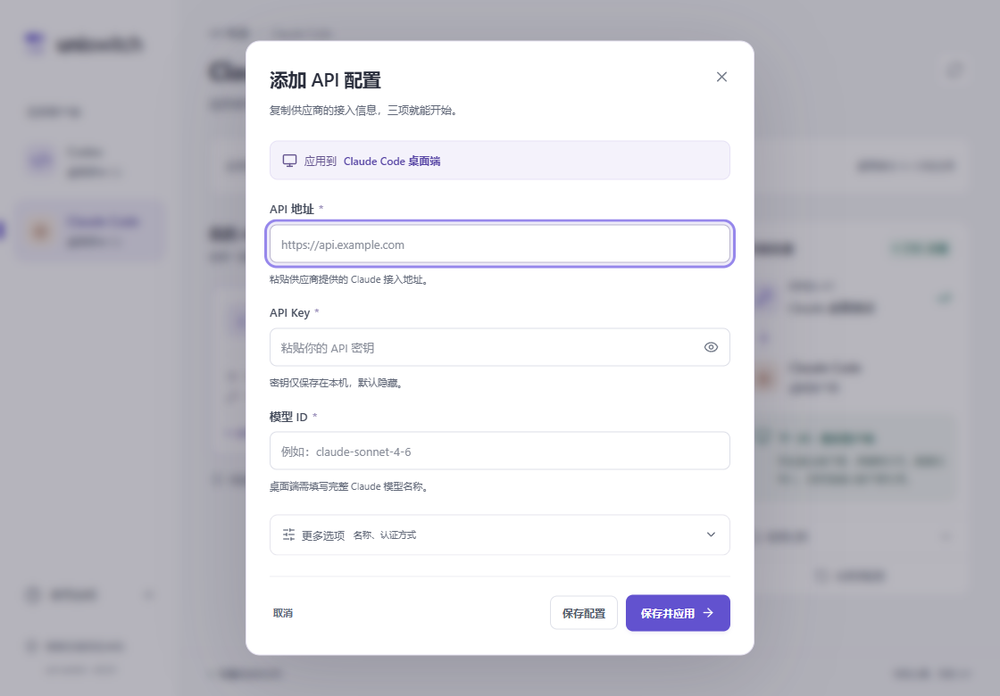

# uni-switch 0.2.0 界面改版

日期：2026-10-06。目标是让第一次使用的人看清操作顺序，填入 API 信息即可应用；常用切换操作保持直接可见。

## 主要变化

- 客户端固定在左侧选择，主区域显示 API 列表，右侧显示当前配置、应用状态和下一步操作。Claude 默认选择桌面客户端。
- 移除占据主页面的大幅宣传标题，统一文字层级、控件尺寸、圆角、颜色与间距，使用浅色背景、白色内容区与紫色操作强调。
- 空页面提供明确的“添加第一组配置”入口和三步引导；已有配置使用纵向列表，名称、地址、模型与应用操作更容易扫读。
- 添加表单默认只展开地址、密钥和模型三项，自动填写配置名称。名称、认证方式、推理强度收纳到“更多选项”。
- 表单明确显示应用目标。保留“保存配置”，增加“保存并应用”，减少首次接入步骤。按 Enter 默认使用保存并应用。
- 保存成功而应用失败时，弹窗保留错误与输入，重试沿用已保存的配置 ID，避免重复新增。处理过程中阻止重复提交及关闭弹窗。
- 已应用配置标记明确，按钮显示“已应用”；编辑未应用时恢复“重新应用”操作。应用后持续显示重启客户端提示。
- 默认折叠配置目录，保留修改目录、查看文件、导入与恢复。常规操作不需要先理解文件结构。
- 小窗口先显示配置列表，连接信息排在后面；导航改为顶部切换。表单按钮保持可见，长内容可以滚动。
- 使用 Radix 管理标签页和弹窗焦点，提供输入错误关联、加载反馈、键盘焦点与减少动画支持。

## 运行验证

| 检查                        | 结果                                                                   |
| --------------------------- | ---------------------------------------------------------------------- |
| TypeScript 与 Vite 生产构建 | 通过                                                                   |
| Vitest                      | 9 个测试通过，新增保存并应用与失败重试检查                             |
| 浏览器流程                  | 8 组检查通过，无页面错误                                               |
| Axe                         | 首次使用、默认表单、展开认证选项、已应用页面共 4 个状态均为 0 个违规项 |
| 窗口适配                    | 1440×900、1120×780、760×600、390×844，页面和表单无横向溢出             |
| 原生 Tauri                  | 8 组检查通过，使用真实 IPC 和隔离客户端配置目录                        |
| Windows x64 发布构建        | 桌面程序与中文 NSIS 安装包生成成功                                     |

原生流程包括 Codex 写入/导入/恢复、使用中配置删除保护、Claude 桌面四文件写入与恢复、CLI 独立写入、编辑时空密钥保留、认证方式切换，以及损坏 JSON 下“保存并应用”失败后修复重试、不重复新增。

所有写入测试使用隔离目录与合成 Key，没有修改用户真实客户端配置。这次改版不增加真实供应商推理验收；协议与客户端版本边界继续见 [核心验证记录](verification.md)。

结果记录在 `.qa/ui-v2/browser-results.json` 和 `.qa/ui-v2/desktop-results.json`。复现命令：

```powershell
corepack pnpm test
corepack pnpm build
# 启动 dev:web 后，验证浏览器界面
node scripts/qa-browser.mjs
# 使用 qa-webview 构建和独立应用数据目录启动测试程序后
node scripts/qa-desktop.mjs
& .\scripts\with-msvc.ps1 -Action build
```

测试用 `qa-webview` 可执行文件与发布程序分开，正式安装包没有启用测试调试端口。每次完整原生流程应使用新的隔离应用数据目录。

发布程序已在隔离数据目录启动，窗口正常响应，SQLite 初始化成功；确认未开放测试用 9223 调试端口。产物为 `release/windows-x64/uni-switch_0.2.0_x64-setup.exe` 与 `uni-switch_0.2.0_x64.exe`，校验值见同目录 `SHA256SUMS-0.2.0.txt`。

## 原生截图

截图中的配置与密钥尾号均为隔离测试数据。






