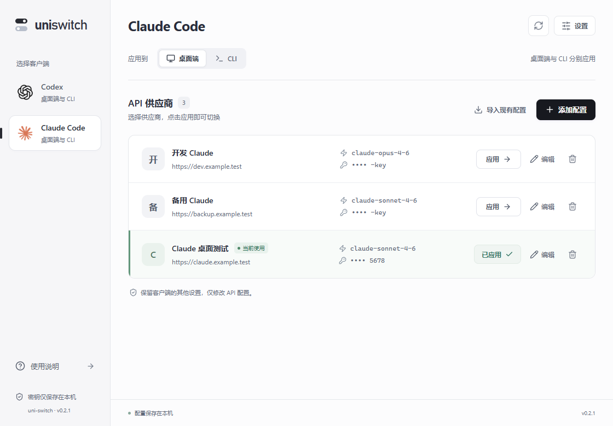
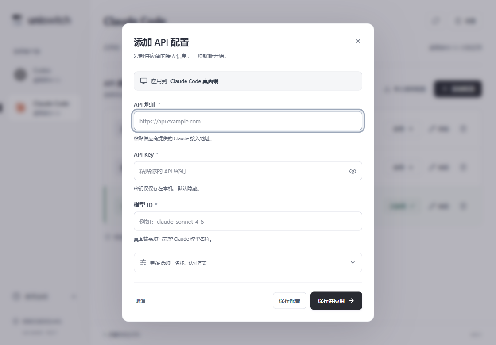
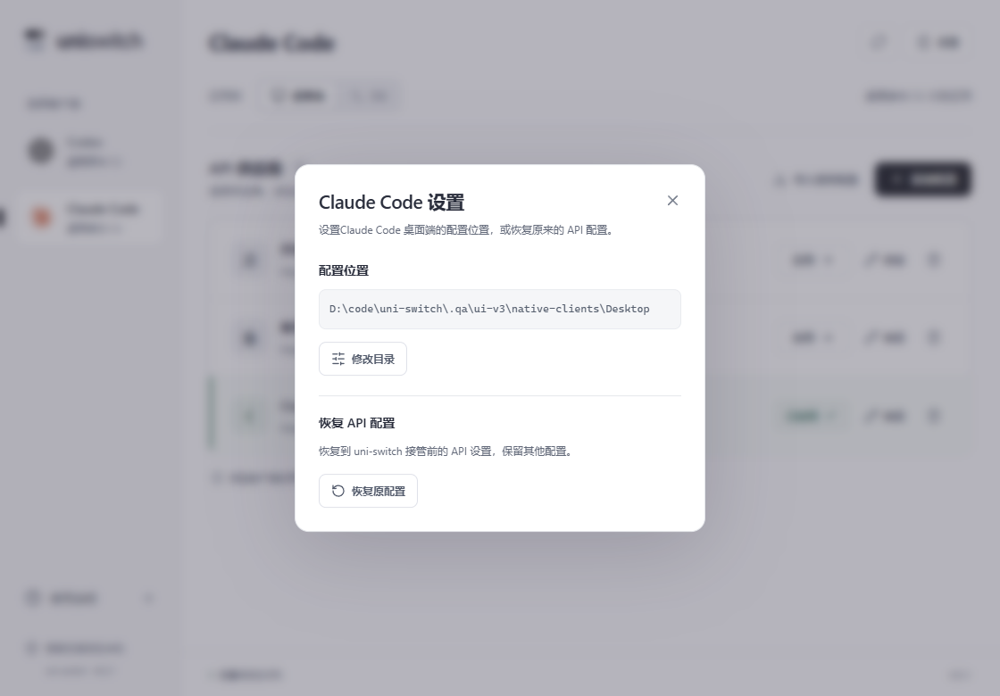

# 0.2.1 供应商列表改版

2026-10-06，按用户反馈调整：左侧使用官方原始 Logo，右侧取消当前连接面板，只显示当前产品的 API 供应商列表。

## 界面

- Codex 使用已安装的官方 Windows 包原始图标，Claude 使用 `claude.com/icon.png` 的原始图标。图片打包在应用内，运行时不联网加载。具体来源见 [品牌资源说明](../src/assets/brands/README.md)。
- API 供应商改为完整宽度的横向列表，每行显示名称、API 地址、模型、遮罩密钥尾号，以及应用、编辑、删除操作。
- 当前配置只在列表内标记“当前使用”；编辑后尚未写入客户端时显示“待应用修改”。
- 右上角“设置”集中提供目录修改与恢复原配置。表单保持地址、密钥、模型三个主要输入项，支持“保存并应用”。
- 使用中性白灰底色、深色主按钮，窄窗口允许行内信息和操作换行。

以下截图来自 0.2.1 原生 Windows 客户端。截图中的供应商、域名和密钥为隔离测试数据，安装包不包含这些示例配置。

## 验证

- TypeScript 检查及 Vite 生产构建通过，Windows x64 NSIS 安装包构建成功。
- 前端现有测试 9 项通过。
- 浏览器 UI 8 组通过，页面错误 0；1440、1120、760、390 宽度下页面及表单无横向溢出。
- 浏览器 Axe 检查覆盖空页面、默认表单、更多选项、已应用列表，共 4 种状态，违规 0。
- 原生设置弹窗 Axe 违规 0，Escape 关闭后焦点返回“设置”按钮。
- 真实 Tauri IPC 8 组通过：Codex 写入、导入与删除反馈、恢复；Claude 桌面四文件写入与恢复、认证修改；Claude CLI 独立应用与恢复；损坏 JSON 的错误处理和保存后重试。
- 发布版独立程序在隔离目录启动成功，窗口响应正常、数据库初始化成功，9223 调试端口未监听；安装包和独立程序的 SHA256 均已校验。

所有写入测试使用 `.qa/ui-v3` 下的独立数据库及客户端目录。此次没有使用真实供应商 API；“已应用”代表配置文件校验成功。底层兼容性边界仍见 [核心验证记录](verification.md)。

自动验证入口为 `scripts/qa-browser.mjs` 和 `scripts/qa-desktop.mjs`，运行结果保存在 `.qa/ui-v3/browser-results.json`、`.qa/ui-v3/desktop-results.json`、`.qa/ui-v3/settings-accessibility.json`、`.qa/ui-v3/release-smoke.json`。

## 交付

- `release/windows-x64/uni-switch_0.2.1_x64-setup.exe`
- `release/windows-x64/uni-switch_0.2.1_x64.exe`
- `release/windows-x64/SHA256SUMS-0.2.1.txt`

发布包使用默认 desktop feature 构建，不含 QA 专用 WebView 调试端口。
