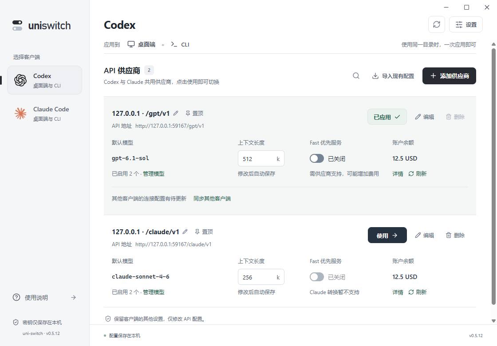
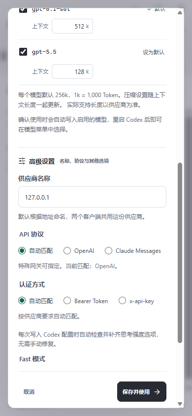

# 0.5.0 使用体验整改

> 0.5.2将配置目录改为直接使用当前位置，仅在设置中管理，取消自动搜索及目录确认，见[配置位置简化](config-location.md)。本页保留0.5.0行为与验收记录。

正常接入仍只需 API 地址与 API Key，点击一次“添加并使用”。日常切换点击一次“使用”；不新增当前连接面板，官方 Logo 与共享供应商列表保持原位置。

## 结果与等待

供应商行区分已配置、已应用、待重启、待更新、配置需处理、正在恢复。状态代表配置和后台服务检查，不代表上游推理验证。桌面端需重启，CLI 需退出旧进程并重新启动。不会强制关闭用户客户端或自动发送计费推理。

提交分为确认配置位置、获取模型、写入并校验。前两阶段可取消，迟到响应无法保存供应商或应用配置；仅实际短提交阶段锁定关闭。长等待有解释。切换时只有正在处理的供应商按钮显示等待。

错误按认证、权限、路径、限流、网络、模型权限、目录歧义、外部配置修改和转换服务分类。提示提供对应操作；诊断详情可复制并隐藏当前输入密钥与常见凭据格式。成功提示自动消失，需要处理的问题保留。

## 配置位置

启动与聚焦时检查目录，失败允许重试；提交前前端和后端再次确认。唯一可靠候选自动绑定；尚无配置且只有默认位置时允许创建。多个有效候选、搜索不完整、明确环境线索未确认、当前格式损坏时不写入，直接在流程中选择。手动指定和已接管目录不会自动更换。

运行客户端在其他位置时显示范围提示。Codex 桌面与 CLI 使用同一位置才一起生效；不同位置需按实际目标选择。Claude 桌面仍需要支持第三方推理的客户端；配置结构可以检查，不能据此保证所有客户端版本兼容。

## 模型与共享更新

“更换模型”独立于高级设置。已启用和默认模型优先显示，不适用模型默认隐藏。每模型上下文仍默认256k，未启用模型不能修改上下文。模型区与弹窗使用同一主滚动区域。

同地址更换密钥保留模型草稿，但需要重新验证新密钥。2026-10-07修订：成功同步只保留上游最新模型，下架默认值自动换成仍启用的可用模型；新发现适用模型默认全选，已取消项保持取消。取消草稿不会落盘，已有连接只读刷新失败可继续使用已保存模型。详见[同步移除下架模型](model-catalog-refresh.md)。思考强度修复仅修复菜单，256k配置和Fast设置不构成供应商能力保证。

供应商修改后提示其他客户端的更新范围，并提供“同步其他客户端”。可在设置记住自动跟随偏好。同步更新地址和密钥，保留各目标上次确认的默认模型、上下文、Fast和思考设置。每目标分别使用可恢复事务；部分失败按目标报告，成功目标不回滚，失败目标保留原配置。同步后的目标快照持久保存，列表显示该目标实际配置的模型。只保存供应商不触发其他目标应用。

完全相同的地址、密钥、协议、认证与模型设置复用已有ID。不同模型设置、不同密钥或路径保留独立记录，不自动合并历史数据。重名优先补密钥尾号，尾号也相同则补路径。更多菜单可直接改名、置顶；已使用供应商禁用删除并解释原因。搜索覆盖启用模型，自动刷新不改变当前浏览顺序。

## 余额与后台

余额仍默认自动识别站点，不需要选择类型或填写接口。成功识别后缓存查询策略15分钟，接口变化再重新识别。不支持查询约30分钟后再探测，余额权限失败约15分钟后重试，网络和限流采用逐步退避；手动刷新和更换连接可主动重新查询。最多三家并发，进行中的查询去重。

展示账户余额、密钥额度、订阅或可用额度来源。密钥不限额不代表账户无限余额。刷新失败保留上次金额并标记查询时间；极小的非零余额不会误显示成确切0。查询失败不阻断接入。

设置提供随Windows登录后台启动，关闭主窗口保留托盘；后台启动不弹窗，重复打开唤起原窗口。退出托盘时说明兼容转换会停止。仅修改当前用户启动项，卸载清理本应用启动项。隔离运行禁止更改系统启动项。

## 验证边界

本次0.5.0最终验收：

| 检查 | 结果 |
| --- | --- |
| 前端行为测试 | 43项通过 |
| Rust测试 | 84项通过；1项辅助进程测试按设计忽略 |
| TypeScript、生产构建、Clippy | 通过 |
| 原生使用流程 | 15组通过，前端运行错误为0 |
| Axe可访问性 | 8处检查，违规为0 |
| Codex使用Claude模型 | 6组通过，真实Codex CLI/app-server 0.160 |
| Claude使用GPT模型 | 5组通过，真实Claude CLI 2.1.179 |
| 正式版启动烟测 | 隐藏启动、重复打开唤起窗口、第二进程退出、数据库初始化和响应检查通过；9223调试端口关闭 |

前端测试覆盖取消迟到响应、目录阻断、模型消失、错误分类、额度退避与原有草稿流程。Rust测试覆盖重复记录、目标专属设置保留、快照重开、目录歧义、余额接口缓存，以及原有配置事务和双向协议。

原生脚本 `scripts/qa-ux-flow.mjs` 使用隔离目录和本地假供应商，最新记录在 `.qa/ux-flow/results.json`，0.5.0归档在 `.qa/ux-flow/native/1791319219621/results.json`。正式版脚本 `scripts/qa-production-ux.ps1` 检查实际Tauri界面窗口，避免将单实例插件内部窗口误判为主界面，最新记录在 `.qa/ux-flow/production-results.json`，0.5.0归档在 `.qa/ux-flow/production/1791319779234/results.json`。

真实Codex app-server读取模型与上下文；双向转换通过真实CLI与本地模拟上游验证，不操作用户真实Codex/Claude配置，不代表任意第三方供应商兼容性。Claude桌面模型配置和转换请求已验证，真实桌面聊天需对应客户端环境；没有以真实Windows注销重登来验证启动项。缩放布局使用125%、150%、200%对应的可用窗口空间验证，没有修改系统DPI。

截图：

