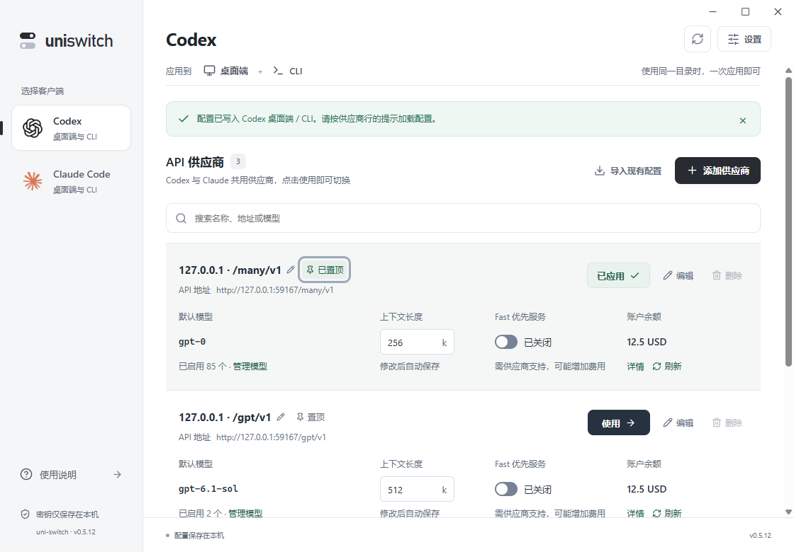

# 0.5.1 操作细节优化

这一轮沿用0.5.0的两字段接入、共享供应商和行内状态，优先解决实际流程中仍需用户判断、重复操作和容易误触的部分。

| 检查发现 | 实现 |
| --- | --- |
| 复制了完整的`/v1/responses`或`/v1/chat/completions`，模型接口拼接失败 | 识别末尾的responses、messages、models、chat/completions，保留原协议、端口与网关前缀，自动整理为接入地址。带查询参数、片段或URL认证的输入仍要求修正，不擅自删除。 |
| 密钥带Bearer、外侧引号或空白，用户不知道如何处理 | 自动清理常见复制格式，原密钥不显示在提示中；内部换行仍拒绝。整理同样作用于Enter提交与后台只读探测。 |
| 换模型需要先打开更多菜单再编辑 | 点击行内模型直接展开模型选择，并将键盘焦点放入模型区。仍使用原确认事务，取消不保存。 |
| 未启用模型要先勾选再设置默认 | “启用并设为默认”一步完成，其他已启用模型和上下文保留。 |
| 几十或上百模型时表单太长，选择难核对 | 每批显示40项，搜索覆盖整个列表；默认、缺失和非法上下文优先。“只看已启用”便于核对，切换视图不改变模型选择。 |
| 应用失败后的重试实际只查目录，没有重试应用 | 操作提示保留原动作。认证问题进入供应商编辑，目录问题进入位置设置，外部修改进入冲突处理，其余可重试原操作。表单重试重新执行完整提交检查。 |
| 数据库读取失败被当成没有供应商，刷新失败也可能提示成功 | 独立读取失败状态，禁止未读取完成时导入或添加；刷新失败保留旧列表并如实报告。 |
| 点弹窗外侧可能意外丢失输入 | 供应商表单不通过外侧点击关闭；取消、关闭按钮、Escape仍明确丢弃草稿。 |
| 少量供应商没有搜索入口，已置顶状态不明显 | 少量列表提供搜索图标，Ctrl+F可聚焦搜索，Escape清空；搜索显示匹配数量，置顶有行内标识。 |
| 极小非零余额被格式化为0 | 显示小于最小展示单位，保留负值符号；确切0仍显示0。悬停摘要可查看查询时间。 |

地址整理只处理明确的请求端点后缀，不自动猜测HTTPS、删查询凭据或修改任意自定义路径。模型探测仍不发送收费推理请求，模型能力与余额查询范围仍由供应商决定。

## 验收

前端测试覆盖接入整理、Enter提交、未启用模型设默认、85模型搜索与选择保留、点击外侧保留草稿、首次读取失败、刷新失败、应用重试、快捷模型焦点和Ctrl+F。原生验收脚本继续使用隔离目录与模拟供应商，不修改用户真实配置。

59项前端测试通过；20组原生流程通过，10处Axe检查无违规，前端运行错误为0。原生流程验证了85模型分批显示、搜索未展开模型、一步设默认、两字段接入、完整地址与Bearer整理、取消不写入、共享同步、真实Codex读取模型上下文和窗口适配。

原生结果在`.qa/ux-flow/results.json`。仍采用本地模拟上游，不代表所有供应商兼容性；Claude桌面真实聊天UI和实际Windows注销重登未验收。

0.5.1正式安装包构建通过。生产烟测验证了数据库初始化、后台隐藏启动、重复打开唤起主界面、第二进程退出、窗口响应及9223调试端口关闭，结果在`.qa/ux-flow/production-results.json`。安装器和独立可执行文件位于`release/windows-x64/`，SHA256校验值在`SHA256SUMS-0.5.1.txt`。

